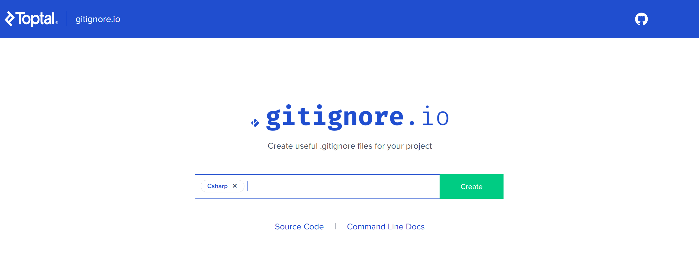
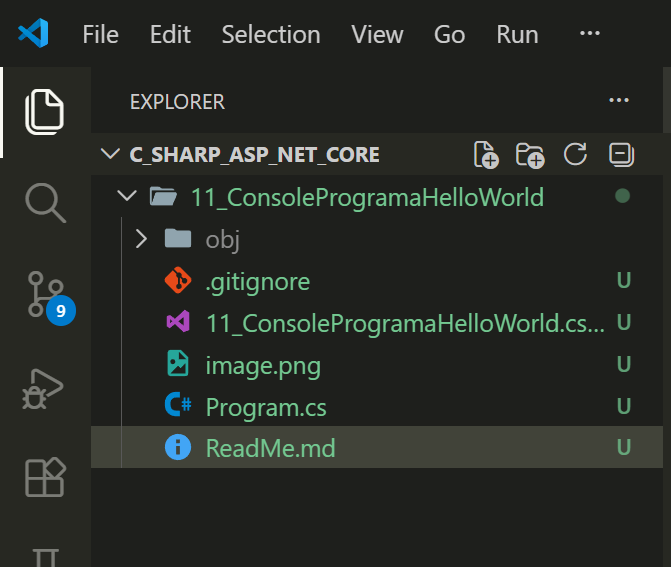

# Paso 1: CREACION DE AREA DE TRABAJO
Cree el directorio mkdir 11_ConsoleProgramHelloWorld

# Paso 2: Seguridad - elementos que no deben subirse a GitHub
1. Me fui a la pagina https://www.toptal.com/developers/gitignore/api/csharp y generé , para CSharp cuales son los archivos y carpetas que no deben subirse a GitHub , por seguridad.

    Escribimos en la ventana CSharp y Create
    

2. El texto generado lo copiamos. ( Es largo: Contiene todas las direcciones de elementos a no subir a GitHub)
3. Creamos, dentro de la carpeta del proyecto, el archivo .gitignore  y le copiamos el texto generado del punto 2.

# Paso 3: Creacion de un proyecto ASP.NET Core de Consola.
( Ya teniamos instalado en nuestra PC el SDK dotnet (.NET) ).

Sino nos acordamos de los comando podemos hacer:  

---
```bash  

.dotnet --help
```
---

---
```bash
dotnet --help
Uso: dotnet [runtime-options] [path-to-application] [arguments]

Ejecute una aplicación de .NET.

runtime-options:
  --additionalprobingpath <path>   Ruta de acceso que contiene la directiva de sondeo y los ensamblados para los que realizar el sondeo.
  --additional-deps <path>         Ruta de acceso al archivo deps.json adicional.
  --depsfile                       Ruta de acceso al archivo <aplicación>.deps.json.
  --fx-version <version>           Versión de la instancia de Shared Framework instalada que se usará para ejecutar la aplicación.
  --roll-forward <setting>         Reenviar a la versión del marco (LatestPatch, Minor, LatestMinor, Major, LatestMajor, Disable).
  --runtimeconfig                  Ruta de acceso al archivo <aplicación>.runtimeconfig.json.

path-to-application:
  La ruta de acceso al archivo .dll de una aplicación que se ejecutará.       

Uso: dotnet [sdk-options] [command] [command-options] [arguments]

Ejecute un comando del SDK de .NET.

sdk-options:
  -d|--diagnostics  Habilita la salida de diagnóstico.
  -h|--help         Muestra ayuda de la línea de comandos.
  --info            Muestra la información de .NET.
  --list-runtimes   Muestra los runtimes instalados.
  --list-sdks       Muestra los SDK instalados.
  --version         Muestra la versión del SDK de .NET en uso.

Comandos de SDK:
  add               Agrega un paquete o una referencia a un proyecto de .NET. 
  build             Compila un proyecto de .NET.
  build-server      Interactúe con los servidores que inicia una compilación. 
  clean             Limpia los resultados de compilación de un proyecto .NET. 
  format            Aplicar preferencias de estilo a un proyecto o solución.  
  help              Muestra ayuda de la línea de comandos.
  list              Enumera las referencias de proyecto de un proyecto de .NET.
  msbuild           Ejecuta comandos de Microsoft Build Engine (MSBuild).     
  new               Crea un nuevo archivo o proyecto de .NET.
  nuget             Proporciona comandos NuGet adicionales.
  pack              Crea un paquete de NuGet.
  publish           Publica un proyecto de .NET para implementación.
  remove            Quita un paquete o una referencia de un proyecto de .NET. 
  restore           Restaura dependencias especificadas en un proyecto de .NET.
  run               Compila y ejecuta la salida de un proyecto de .NET.       
  sdk               Administra la instalación del SDK de .NET.
  sln               Modifica los archivos de la solución de Visual Studio.    
  store             Almacena los ensamblados especificados en el almacén del paquete de tiempo de ejecución.
  test              Ejecuta pruebas unitarias usando el ejecutor de pruebas especificado en un proyecto de .NET.
  tool              Instala o administra herramientas que mejoran la experiencia de .NET.
  workload          Administrar cargas de trabajo opcionales.

Comandos adicionales para herramientas incluidas:
  dev-certs         Crea y administra certificados de desarrollo.
  fsi               Inicie F# interactivo o ejecute scripts de F#.
  user-jwts         Administre los tokens web JSON en el desarrollo.
  user-secrets      Administra secretos de usuario de desarrollo.
  watch             Inicia un monitor de archivo que ejecuta un comando cuando los archivos cambian.

Ejecute "dotnet [comando] --help" para más información sobre un comando.  
```

Para un proyecto de consola ( En Windows ) le damos a :
---
dotnet new console
---
y genera:

---
```bash
E:\Python\WorkSpace curso Python_HTML_CSS_JavaScript\14 CURSO PROGRAMACION WEB DE eFUNDAE\C_Sharp_ASP_NET_CORE\11_ConsoleProgramaHelloWorld> dotnet new console
La plantilla "Aplicación de consola" se creó correctamente.

Procesando acciones posteriores a la creación...
Restaurando E:\Python\WorkSpace curso Python_HTML_CSS_JavaScript\14 CURSO PROGRAMACION WEB DE eFUNDAE\C_Sharp_ASP_NET_CORE\11_ConsoleProgramaHelloWorld\11_ConsoleProgramaHelloWorld.csproj:
  Determinando los proyectos que se van a restaurar...
  Se ha restaurado E:\Python\WorkSpace curso Python_HTML_CSS_JavaScript\14 CURSO PROGRAMACION WEB DE eFUNDAE\C_Sh
  arp_ASP_NET_CORE\11_ConsoleProgramaHelloWorld\11_ConsoleProgramaHelloWorld.csproj (en 43 ms).
Restauración realizada correctamente.
```
---

Asi se ve el directorio del proyecto ( Desplegue el obj que tiene 5 objetos en su interior.)


Luego tenemos el .gitignore que lo cree.

Tenemos el archivo del proyecto: **11_ConsoleProgramaHelloWorld.csproj**

Luego 2 imagenes , que he usado hasta ahora, el ReadMe.md que es este mismo archivo y el Program.cs

DETALLE DEL ARCHIVO DE PROYECTO: 11_ConsoleProgramaHelloWorld.csproj:  

---
```CS
<Project Sdk="Microsoft.NET.Sdk">

  <PropertyGroup>
    <OutputType>Exe</OutputType>
    <TargetFramework>net8.0</TargetFramework>
    <RootNamespace>_11_ConsoleProgramaHelloWorld</RootNamespace>
    <ImplicitUsings>enable</ImplicitUsings>
    <Nullable>enable</Nullable>
  </PropertyGroup>

</Project>
```
---

y EL ARCHIVO PRINCIPAL  ( QUE CORRE CUANDO HACEMOS dotnet run)

---
```cs
// See https://aka.ms/new-console-template for more information
Console.WriteLine("Hello, World!");

```
---

Que al aplicar en la terminal ( dobre el direcorio principal, dotnet run , mostrará ):

PS E:\Python\WorkSpace curso Python_HTML_CSS_JavaScript\14 CURSO PROGRAMACION WEB DE eFUNDAE\C_Sharp_ASP_NET_CORE\11_ConsoleProgramaHelloWorld> **dotnet run**  

Hello, World!
