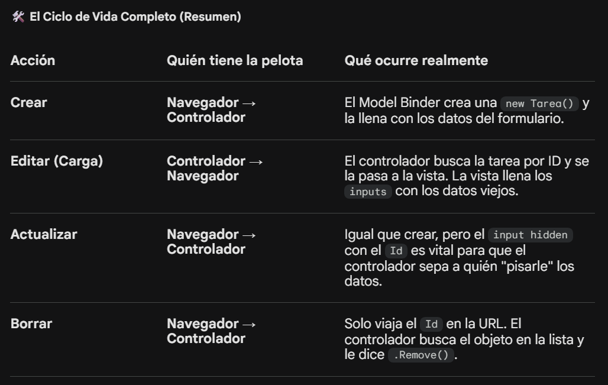

# EXPLICACION GENERAL DE COMO FUNCIONA UNA APLICACION ASP.NET Core.

## Por ejemplo veamos como se CREA una TAREA.

Gran parte de la magia se llama **Model Binding (Enlazado de Modelos)** , y es como una cinta transportadora invisible que viaja entre el usuario y tu código.

Vamos a seguir el viaje de los datos en el **proceso de Crear**, que es el más completo.

1. La Fase de "Carga" (GET)
Cuando haces clic en "+ Nueva Tarea" ( Boton en archivo Index.cshtml), le pides al controlador:  

 "Dame el formulario".

Controlador:  
Ejecuta public IActionResult Crear(). Simplemente retorna la vista.

Vista (Crear.cshtml):  
Al tener **@model ToDoApp.Models.Tarea** al inicio, la vista se prepara. Los Tag Helpers (asp-for="Titulo") leen tu clase Tarea y generan HTML real.

Lo que tú escribes:  
---
```html
 <input asp-for="Titulo" />  
 ```
 ---

Lo que el navegador recibe:  
---
```html
 <input type="text" id="Titulo" name="Titulo" value="">
 ```
 ---

Aquí ocurre el primer enlace:  
.NET "mapea" cada propiedad de tu clase a un nombre de campo HTML.

2. El Envío del Formulario (POST)
Aquí es donde la pelota vuela. Cuando pulsas "Guardar":

El navegador empaqueta todos los campos en un solo bloque de datos llamado HTTP Request Body.

Ese bloque llega al servidor como una lista de "Nombre=Valor" (ej: Titulo=Comprar pan & Lugar=Arabe).

3. El Motor:  
Model Binding (La Magia Real)
Antes de que tu código en el controlador se ejecute, ocurre el proceso de ensamblado:

El motor de .NET ve que tu método recibe un objeto Tarea nuevaTarea.

Él mismo empieza a buscar:  
"¿Hay algo en el formulario que se llame 'Titulo'? Sí, dice 'Comprar pan'. Lo pongo en nuevaTarea.Titulo".

"¿Hay algo que se llame 'FechaVencimiento'? Sí. Lo convierto de texto a un objeto DateTime y lo pongo ahí".

Es como un set de LEGO: El navegador manda las piezas sueltas y .NET las ensambla automáticamente siguiendo el manual que es tu Modelo. Cuando entras a tu método Crear(Tarea nuevaTarea), el motor ya te entrega el objeto armado y listo para usar.



🎨 ¿Por qué el formulario parece "misterioso"?
Porque los Tag Helpers (asp-for, asp-action) hacen mucho trabajo por ti. Ellos generan las rutas correctas y aseguran que los nombres coincidan exactamente con tu modelo para que el Model Binding no falle.

💡 Ejemplo de un detalle clave :
No ves un new Tarea() explícito en tu código de "guardado" porque ASP.NET lo hace por ti en el momento en que declaras el objeto en los paréntesis del método del controlador.

Si quieres ver cómo funciona el "cerebro" de .NET por dentro, el Model Binding es el lugar perfecto. Para profundizar, imagina que este motor es un detective que busca pistas en diferentes lugares para armar el objeto que tú le pediste.

Aquí tienes los puntos clave para que pases de "lo entiendo" a "lo domino":

### 1. ¿De dónde saca los datos? (Binding Sources)
El Model Binder no solo mira el formulario. Busca en este orden de prioridad:

#### Form Values:  
Los campos del 

```html  
<form>
````
 (lo que hemos usado).

#### Route Values:  
Los datos en la URL, como el id en /Tarea/Editar/5.

#### Query Strings:  
Los parámetros extra al final de la URL, como el filtro en /Tarea?filtro=activas.

#### Files:  
Los archivos que vienen en el IFormFile.

2. Atributos para "forzar" el origen
A veces quieres que el Model Binder solo busque en un sitio específico. Puedes usar atributos en los parámetros de tu controlador para ser más estricto:

[FromForm]:  
Solo busca en los campos del formulario.

[FromRoute]:  
Solo busca en la URL (ej: el ID).

[FromQuery]:  
Solo busca en los parámetros tras el signo ?.

3. ModelState  
El informe de errores
Esta es la parte más útil para un programador. Cuando el Model Binder termina de "ensamblar" tu objeto Tarea, deja un informe en una propiedad llamada ModelState.

Si el usuario escribió "letras" en un campo de "fecha", ModelState.IsValid será false.

Por eso siempre ponemos if (ModelState.IsValid) en el controlador; es nuestra forma de preguntar: "¿El motor pudo armar el objeto correctamente?".

4. ¿Dónde leer más y practicar?
Si quieres convertirte en un experto en el "motor", te recomiendo estos recursos:

Documentación oficial de Microsoft (Model Binding in ASP.NET Core):  
Es la "biblia". Busca exactamente ese término. Explica cómo .NET maneja incluso listas complejas o diccionarios.

Tutoriales de "Overposting":  
Busca sobre este concepto. Es un riesgo de seguridad donde un usuario malintencionado envía campos extra que no están en el formulario (como un campo EsAdmin=true) y el Model Binder, al ser tan eficiente, los mete en tu objeto. Aprender a evitar esto usando Bind o ViewModels es el siguiente paso profesional.

💡 El consejo del "Mecánico"
La mejor forma de "ver" el motor funcionando es poner un punto de interrupción (Breakpoint) en la primera línea de tu método Crear o Editar. Cuando el programa se detenga ahí, pon el ratón sobre el objeto nuevaTarea y despliega sus propiedades. Verás cómo, mágicamente, todas están llenas con lo que escribiste en la web antes de que se ejecutara una sola línea de tu código.