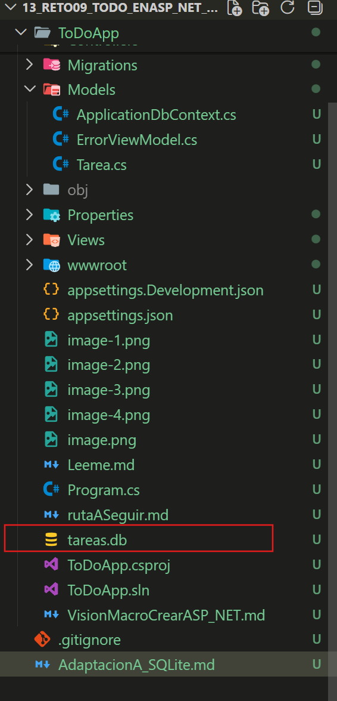
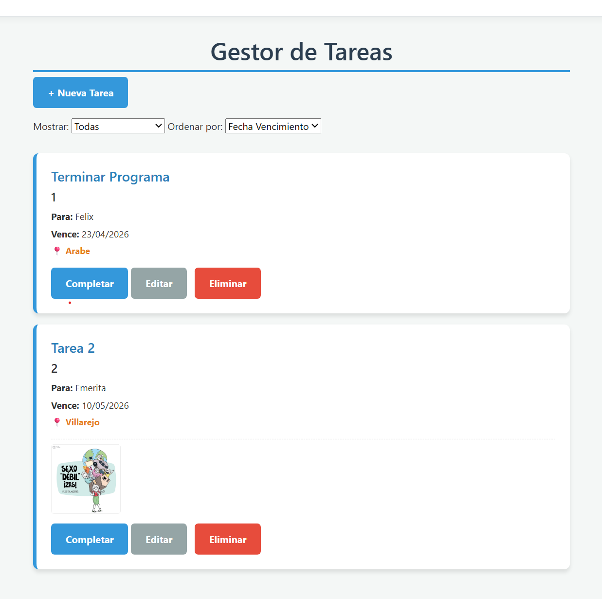

# CREAR PERSISTENCIA DE DATOS USANDO SQLITE.
Este proyecto inicio con un array de instancias de Tarea. Es decir, sin persistencia de datos.
En TareaControlle.cs se creo un atributo de clase, que es un array de instancias de la clase Tarea ( Ubicada en Models/Tarea.cs)

 private static List<Tarea> _tareas = new List<Tarea>();

La idea es crear PERSISTENCIA...

## Implementación de SQLite (La Persistencia)
Ahora que la red de seguridad está puesta, vamos a convertir este proyecto en una aplicación con memoria real. Sigue estos pasos en orden:

🛠️ 1. Instalación de Herramientas (NuGet)
En la terminal de VS Code (asegúrate de estar dentro de la carpeta ToDoApp), ejecuta estos tres comandos uno por uno:

---
```bash
dotnet add package Microsoft.EntityFrameworkCore.Sqlite
dotnet add package Microsoft.EntityFrameworkCore.Design
dotnet add package Microsoft.EntityFrameworkCore.Tools  
```
---

¿Qué estamos instalando?  
El primero es el "driver" de la base de datos,  
el segundo permite que .NET diseñe la base de datos por nosotros,  
y el tercero nos da los comandos de consola.

🛠️ 2. Crear el Contexto de la Base de Datos
Dentro de tu carpeta Models, crea un nuevo archivo llamado ApplicationDbContext.cs.   
Este archivo es el corazón de la base de datos; es el que le dice a C# qué tablas existen.

---
```c#
using Microsoft.EntityFrameworkCore;

namespace ToDoApp.Models
{
    public class ApplicationDbContext : DbContext
    {
        public ApplicationDbContext(DbContextOptions<ApplicationDbContext> options)
            : base(options)
        {
        }

        // Esta propiedad se convertirá en nuestra tabla de Base de Datos
        public DbSet<Tarea> Tareas { get; set; }
    }
}  
```
---

# SI EL ARCHIVO ANTERIOR DA ERRORES COPIAR ESTE ARCHIVO: ToDoApp.csproj

El archivo ApplicationDbContext.cs ( Ubicado en Models ) marcaba en rojo todos los elementos relacionados con la Entity, DBContext....Es decir, parecia mal instaladas las dependencias. Despues de varios comandos para tratar de resolverlo la solucion final fue copiar textualmente el archivo siguiente , ToDoApp.csproj. 
Cuando se instalan las dependencia se debe actualizar la sesion de `<ItemGroup>` y no estaba como se ve esta version....Bueno, al copiar el ItemGroup como esta aca desaparecieron los errores.


---
```c#
<Project Sdk="Microsoft.NET.Sdk.Web">

  <PropertyGroup>
    <TargetFramework>net8.0</TargetFramework>
    <Nullable>enable</Nullable>
    <ImplicitUsings>enable</ImplicitUsings>
  </PropertyGroup>

  <ItemGroup>
    <PackageReference Include="Microsoft.EntityFrameworkCore.Sqlite" Version="8.0.0" />
    <PackageReference Include="Microsoft.EntityFrameworkCore.Design" Version="8.0.0">
      <IncludeAssets>runtime; build; native; contentfiles; analyzers; buildtransitive</IncludeAssets>
      <PrivateAssets>all</PrivateAssets>
    </PackageReference>
    <PackageReference Include="Microsoft.EntityFrameworkCore.Tools" Version="8.0.0">
      <IncludeAssets>runtime; build; native; contentfiles; analyzers; buildtransitive</IncludeAssets>
      <PrivateAssets>all</PrivateAssets>
    </PackageReference>
  </ItemGroup>

</Project>
```
---
# OTROS RECURSOS PARA TRATAR DE RESOLVER EL ERROR ANTERIOR ( No reconocimiento de las dependencias):

Cuando trabajamos con Entity Framework Core. El problema es que si VS Code todavía no se ha enterado de que instalaste los paquetes, o bien la instalación no se completó correctamente en el proyecto actual, pues tendremos error en el archivo ApplicationDbContext.cs 

El error CS0234: The type or namespace name 'EntityFrameworkCore' does not exist... significa que el compilador está buscando la librería en tu proyecto y no la encuentra.

🛠️ Paso 1. Cómo solucionar el error de importación
Sigue estos pasos en orden para "despertar" a VS Code:

1. Verifica la ubicación en la terminal:
Asegúrate de que tu terminal esté dentro de la carpeta ToDoApp (donde está el archivo .csproj) antes de ejecutar los comandos. Si estás una carpeta más arriba, los paquetes no se instalan en el sitio correcto.

2. Forzar la restauración de paquetes:
Ejecuta este comando para obligar a .NET a descargar y enlazar todo de nuevo:

---
```bash
dotnet restore  
```
---  

3. Si el error persiste, reinstala explícitamente:
A veces, al copiar carpetas, las referencias se rompen. Ejecuta esto dentro de la carpeta ToDoApp:

---
```bash
dotnet add package Microsoft.EntityFrameworkCore.Sqlite  
```
---

4. Reinicia el Omnisharp (El cerebro de VS Code):
Si después de instalar ves que los paquetes están en el archivo .csproj pero las líneas rojas siguen ahí:

Presiona Ctrl + Shift + P.

Escribe: "Restart OmniSharp" y dale a Enter. Esto obliga a VS Code a volver a leer todas las librerías. (**ESTO HAY QUE REVISARLO PUES REALMENTE NO ENCONTRE Restart OmniSharp)

🔍 ¿Cómo saber si está bien instalado?
Abre tu archivo ToDoApp.csproj. Deberías ver unas líneas como estas:

XML
<ItemGroup>
  <PackageReference Include="Microsoft.EntityFrameworkCore.Sqlite" Version="8.x.x" />
  <PackageReference Include="Microsoft.EntityFrameworkCore.Design" Version="8.x.x" />
</ItemGroup>

🛠️ Paso 2: Limpieza de Residuos
A veces VS Code se queda "pegado" a la configuración de la carpeta anterior. Ejecuta esto en la terminal (dentro de ToDoApp):

Borrar carpetas temporales antiguas:

---
```bash
rmdir /s /q bin
rmdir /s /q obj  
```
---
(Si usas Mac/Linux es rm -rf bin obj).

Restaurar desde cero:

---
```bash
dotnet restore
```
---

🛠️ Paso 3: El truco del "Cerebro" de VS Code
Incluso con todo bien instalado, la extensión de C# a veces se "desconecta".

Cierra completamente VS Code.

Ve a la carpeta 13_Reto09_ToDo_EnASP_NET_SQLite en tu explorador de Windows.

Haz clic derecho y elige "Abrir con Code".

Espera unos 30 segundos. Verás en la esquina inferior derecha una barrita de progreso que dice "Finishing Dev Kit initialization" o "Languaje Server". No toques nada hasta que termine.

🛠️ Paso 4: La prueba definitiva
Si las líneas rojas siguen ahí pero tú crees que todo está bien, intenta compilar por fuerza bruta. Escribe en la terminal:

---
```bash
dotnet build  
```
---

Si dice "Compilación correcta":  
Ignora las líneas rojas. Es un fallo de la extensión de VS Code y se irán solas al empezar a escribir.

Si da error:  
Pásale a la IA el mensaje exacto que sale en la terminal tras el dotnet build. Ese mensaje es la verdad absoluta del motor.

# 🛠️ 3. Configurar la Conexión en Program.cs
Abre Program.cs. Debemos registrar este nuevo servicio. Busca donde dice builder.Services.AddControllersWithViews(); y justo debajo añade:

---
```C#
builder.Services.AddDbContext<ApplicationDbContext>(options =>
    options.UseSqlite("Data Source=tareas.db"));  
```
--- 
Esto le dice a la app: "Usa un archivo llamado tareas.db para guardar todo".

**PERO OJO,** al principio de Program.cs hay que importar:  

---
```c#
using Microsoft.EntityFrameworkCore; // Para poder usar UseSqlite
using ToDoApp.Models;               // Para que encuentre tu ApplicationDbContext
```
---


🛠️ 4. Las "Migraciones" (Crear la tabla real)
Ahora viene la magia. Vamos a decirle a .NET: "Mira mi clase Tarea.cs y crea una tabla que coincida". En la terminal ejecuta:

Crear el plano:

---
```bash
dotnet ef migrations add MigracionInicial

```
---
Al tratar de hacer lo anterior me dio error: Al tratar de crear el archivo de migracion ( El Plano) , sin errores en Program.cs, me muestra:

"E:\Python\WorkSpace curso Python_HTML_CSS_JavaScript\14 CURSO PROGRAMACION WEB DE eFUNDAE\C_Sharp_ASP_NET_CORE\13_Reto09_ToDo_EnASP_NET_SQLite\ToDoApp> dotnet ef migrations add MigracionInicial

No se pudo ejecutar porque no se encontró el comando o archivo especificado.

Entre las posibles razones para esto se incluyen:

  * Escribió de manera incorrecta un comando dotnet integrado.

  * Tenía previsto ejecutar un programa .NET, pero dotnet-ef no existe.

  * Tuvo la intención de ejecutar una herramienta global, pero no se encontró un ejecutable con el prefijo dotnet con este nombre en la ruta."  

 Ese error es el pan de cada día cuando se empieza con Entity Framework. Lo que sucede es que el comando dotnet ef no es parte del "paquete básico" de .NET; es una herramienta adicional que hay que instalar en tu sistema para que la terminal la reconozca como un comando válido.

🛠️ Solución: Instalar la herramienta global
Ejecuta este comando en tu terminal (da igual en qué carpeta estés, porque es --global):

---
```bash
dotnet tool install --global dotnet-ef
```
---

Luego volvemos a repetir : dotnet ef migrations add MigracionInicial y mostrara en la terminal:  

---
dotnet ef migrations add MigracionInicial  
Build started...  
Build succeeded.  
Done. To undo this action, use 'ef migrations remove'    
---


Construir el archivo:
---
```bash
dotnet ef database update
```
---

Al ejecutar el comando anterior mostro la creacion de los campos de labase de datos:  

<pre>
E:\Python\WorkSpace curso Python_HTML_CSS_JavaScript\14 CURSO PROGRAMACION WEB DE eFUNDAE\C_Sharp_ASP_NET_CORE\13_Reto09_ToDo_EnASP_NET_SQLite\ToDoApp> dotnet ef database update
Build started...
Build succeeded.
info: Microsoft.EntityFrameworkCore.Database.Command[20101]
      Executed DbCommand (9ms) [Parameters=[], CommandType='Text', CommandTimeout='30']
      PRAGMA journal_mode = 'wal';
info: Microsoft.EntityFrameworkCore.Database.Command[20101]
      Executed DbCommand (3ms) [Parameters=[], CommandType='Text', CommandTimeout='30']
      CREATE TABLE "__EFMigrationsHistory" (
          "MigrationId" TEXT NOT NULL CONSTRAINT "PK___EFMigrationsHistory" PRIMARY KEY,
          "ProductVersion" TEXT NOT NULL
      );
info: Microsoft.EntityFrameworkCore.Database.Command[20101]
      Executed DbCommand (1ms) [Parameters=[], CommandType='Text', CommandTimeout='30']
      SELECT COUNT(*) FROM "sqlite_master" WHERE "name" = '__EFMigrationsHistory' AND "type" = 'table';
info: Microsoft.EntityFrameworkCore.Database.Command[20101]
      Executed DbCommand (0ms) [Parameters=[], CommandType='Text', CommandTimeout='30']
      SELECT "MigrationId", "ProductVersion"
      FROM "__EFMigrationsHistory"
      ORDER BY "MigrationId";
info: Microsoft.EntityFrameworkCore.Migrations[20402]
      Applying migration '20260423072256_MigracionInicial'.
Applying migration '20260423072256_MigracionInicial'.
info: Microsoft.EntityFrameworkCore.Database.Command[20101]
      Executed DbCommand (0ms) [Parameters=[], CommandType='Text', CommandTimeout='30']
      CREATE TABLE "Tareas" (
          "Id" INTEGER NOT NULL CONSTRAINT "PK_Tareas" PRIMARY KEY AUTOINCREMENT,
          "Titulo" TEXT NOT NULL,
          "AsignadoA" TEXT NULL,
          "FechaVencimiento" TEXT NOT NULL,
          "Lugar" TEXT NULL,
          "Direccion" TEXT NULL,
          "Notas" TEXT NULL,
          "EstaCompletada" INTEGER NOT NULL,
          "FechaCulminacion" TEXT NULL,
          "RutaAdjunto" TEXT NULL,
          "RequiereRecordatorio" INTEGER NOT NULL
      );
info: Microsoft.EntityFrameworkCore.Database.Command[20101]
      Executed DbCommand (0ms) [Parameters=[], CommandType='Text', CommandTimeout='30']
      INSERT INTO "__EFMigrationsHistory" ("MigrationId", "ProductVersion")
      VALUES ('20260423072256_MigracionInicial', '8.0.0');
Done.
</pre>  

Si todo sale bien, verás que en tu explorador de archivos de VS Code aparece un nuevo archivo llamado tareas.db. Esa es la base de datos.
Observar que tambien se creo una carpeta Migrations



🚩 El Gran Cambio: El Controlador
Ahora que tenemos base de datos, la lista static List<Tarea> ya no tiene sentido. Debemos conectar el TareaController.cs a la base de datos.

📝 ¿Qué sigue con los cambios en el Controlador ?
El siguiente paso es la cirugía del Controlador. Actualmente, TareaController.cs sigue intentando hablar con la lista estática _tareas, pero ahora debe aprender a hablar con ApplicationDbContext.

Haremos tres cambios clave:

1. Inyectar el Contexto:  
Le diremos al controlador que pida la base de datos al nacer.

2. Cambiar .Add por cambios en DB:  
En lugar de guardar en la lista, guardaremos en la tabla y llamaremos a **_context.SaveChanges()**.

3. Consultas Linq:  
Traeremos los datos directamente de la base de datos para el Index.

### Veamos en detalle cada paso:
1. Inyección del Contexto al Controlador.
Lo primero es decirle al controlador que use el ApplicationDbContext. Vamos a borrar la lista static `List<Tarea>` y a crear un constructor.

Modifica el inicio de tu TareaController.cs:

---
```c#
public class TareaController : Controller
{
    // Creamos una lista en memoria para guardar las tareas temporalmente
    // Al ser "static", se mantiene viva mientras la app esté corriendo
    // private static List<Tarea> _tareas = new List<Tarea>();
    //*******************************************************
    // SUSTITUIMOS: private static List<Tarea> _tareas = ...
    // POR:
    private readonly ApplicationDbContext _context;

    // Para la Base de datos añadimos este constructor que recibe la base de datos
    public TareaController(ApplicationDbContext context)
    {
        _context = context;
    }
    //*********************************************************
```
---

Paso 2: El Index (Filtrado y Orden)
Aquí solo cambia el origen de los datos. En lugar de usar _tareas, usamos _context.Tareas. Toda tu lógica de switch y ViewBag se queda igual.

---
```c#
public IActionResult Index(string filtro, string orden)
{
    // CAMBIO: Empezamos con la base de datos en lugar de la lista
    IQueryable<Tarea> tareasFiltradas = _context.Tareas; 

    // 1. Lógica de Filtrado (Se mantiene IGUAL)
    switch (filtro)
    {
        case "activas":
            tareasFiltradas = tareasFiltradas.Where(t => !t.EstaCompletada);
            break;
        case "completadas":
            tareasFiltradas = tareasFiltradas.Where(t => t.EstaCompletada);
            break;
    }

    // 2. Lógica de Orden con "Desempatador" (Se mantiene IGUAL)
    tareasFiltradas = orden switch
    {
        "nombre" => tareasFiltradas.OrderBy(t => t.Titulo).ThenBy(t => t.FechaVencimiento),
        "persona" => tareasFiltradas.OrderBy(t => t.AsignadoA).ThenBy(t => t.FechaVencimiento),
        _ => tareasFiltradas.OrderBy(t => t.FechaVencimiento)
    };

    ViewBag.FiltroActual = filtro;
    ViewBag.OrdenActual = orden;

    return View(tareasFiltradas.ToList());
}
```
---

Paso 3: El Método Crear (POST)
Aquí eliminamos la línea del Id = _tareas.Count + 1 porque SQLite lo hace solo. Y añadimos el guardado oficial.

---
```c#
[HttpPost]
public IActionResult Crear(Tarea nuevaTarea, IFormFile? archivoAdjunto)
{
    if (ModelState.IsValid)
    {
        // 1. Lógica para guardar el archivo (Se mantiene IGUAL)
        if (archivoAdjunto != null && archivoAdjunto.Length > 0)
        {
            string nombreUnico = Guid.NewGuid().ToString() + "_" + archivoAdjunto.FileName;
            string rutaCarpeta = Path.Combine(Directory.GetCurrentDirectory(), "wwwroot/uploads");
            string rutaCompleta = Path.Combine(rutaCarpeta, nombreUnico);

            using (var stream = new FileStream(rutaCompleta, FileMode.Create))
            {
                archivoAdjunto.CopyTo(stream);
            }
            nuevaTarea.RutaAdjunto = nombreUnico;
        }

        // 2. Guardar la tarea
        // ELIMINADO: nuevaTarea.Id = _tareas.Count + 1; (Ya no hace falta)
        
        _context.Tareas.Add(nuevaTarea); // Añadimos al contexto
        _context.SaveChanges();          // Impactamos la base de datos

        return RedirectToAction("Index");
    }
    return View(nuevaTarea);
}
```
---

Paso 4: El Método Editar y Borrar (La gran mejora)
En lugar de buscar en la lista y actualizar campos manualmente, Entity Framework nos permite hacerlo de forma más elegante.

Editar (POST):

---
```c#
[HttpPost]
public IActionResult Editar(Tarea tareaEditada, IFormFile? nuevoAdjunto)
{
    if (ModelState.IsValid)
    {
        // Buscamos la tarea actual en la DB para no perder la ruta del adjunto viejo si no sube uno nuevo
        var tareaEnDb = _context.Tareas.AsNoTracking().FirstOrDefault(t => t.Id == tareaEditada.Id);
        if (tareaEnDb == null) return NotFound();

        if (nuevoAdjunto != null && nuevoAdjunto.Length > 0)
        {
            string nombreUnico = Guid.NewGuid().ToString() + "_" + nuevoAdjunto.FileName;
            string ruta = Path.Combine(Directory.GetCurrentDirectory(), "wwwroot/uploads", nombreUnico);
            using (var stream = new FileStream(ruta, FileMode.Create))
            {
                nuevoAdjunto.CopyTo(stream);
            }
            tareaEditada.RutaAdjunto = nombreUnico;
        }
        else
        {
            // Si no subió archivo nuevo, mantenemos el que ya tenía
            tareaEditada.RutaAdjunto = tareaEnDb.RutaAdjunto;
        }

        _context.Tareas.Update(tareaEditada); // EF actualiza todos los campos automáticamente
        _context.SaveChanges();
        
        return RedirectToAction("Index");
    }
    return View(tareaEditada);
}

```
---


Borrar:

---
```c#
public IActionResult Borrar(int id)
{
    var tarea = _context.Tareas.Find(id); // Buscamos en DB

    if (tarea != null)
    {
        // Borrado de archivo físico (Se mantiene IGUAL)
        if (!string.IsNullOrEmpty(tarea.RutaAdjunto))
        {
            string rutaArchivo = Path.Combine(Directory.GetCurrentDirectory(), "wwwroot/uploads", tarea.RutaAdjunto);
            if (System.IO.File.Exists(rutaArchivo)) System.IO.File.Delete(rutaArchivo);
        }

        _context.Tareas.Remove(tarea); // Borramos de la DB
        _context.SaveChanges();
    }

    return RedirectToAction("Index");
}
```
---

# ERRORES A CORREGIR EN EL CONTROLADOR
 Dio error con _tareas  y AsNoTracking

Vamos a resolverlos de inmediato:

1. El error de _tareas (Subrayado en rojo)
Este error ocurre porque eliminamos la línea private static `List<Tarea>` _tareas... para poner el _context.

La solución: Debes buscar en todo el archivo del controlador cualquier palabra que diga `_tareas` y reemplazarla por `_context.Tareas`. Recuerda que ahora "la lista" es la tabla de la base de datos.

2. El error de AsNoTracking (CS1061)
Este es un tema de "importación". El método AsNoTracking() pertenece a Entity Framework Core, y aunque tengas instalado el paquete, si no pones la directiva arriba del archivo, C# no la encuentra.

La solución: Añade esta línea al principio de tu TareaController.cs, junto a los otros using:

---
```C#
using Microsoft.EntityFrameworkCore; // <--- ESTA ES LA QUE FALTA
```
---

# EXPLICACION DE LA FUNCIONALIDAD DEL CONTROLADOR
🛠️ Repaso del Controlador (La "Magia" pieza por pieza)
vamos a pasear por el motor. Imagina que el controlador es un camarero en un restaurante:

A. El Constructor (La conexión)

---
```C#
private readonly ApplicationDbContext _context;

public TareaController(ApplicationDbContext context) {
    _context = context;
}
```
---  

Cómo funciona: Cuando la aplicación arranca, .NET lee el Program.cs y ve que configuraste SQLite. Cuando alguien pide ver las tareas, .NET crea el controlador y le "pasa" la conexión a la base de datos lista para usar. Tú no tienes que abrir la base de datos manualmente, .NET te la entrega en la mano.

B. El Método Index (La Consulta)

---
```C#
IQueryable<Tarea> tareasFiltradas = _context.Tareas;
```
---

La magia:  
`IQueryable` es una "promesa" de consulta. No trae los datos todavía. Solo cuando llegamos al final y hacemos .ToList(), Entity Framework traduce todo tu C# (los Where y OrderBy) a una sola sentencia SQL y le pregunta a la base de datos: "Oye, dame solo las tareas que no estén completadas y ordénalas por fecha".

C. El Método Crear (El Guardado)

---
```C#
_context.Tareas.Add(nuevaTarea); 
_context.SaveChanges();
```
---

La magia:  
Al hacer .Add, le dices al contexto: "Tengo esta nueva pieza". Pero la verdadera magia está en SaveChanges(). En ese momento, Entity Framework abre una conexión rápida al archivo tareas.db, inserta la fila, y SQLite genera automáticamente el ID. Por eso ya no necesitamos tu antigua lógica de Count + 1.

D. El Método Editar (AsNoTracking)
---
```C#
var tareaEnDb = _context.Tareas.AsNoTracking().FirstOrDefault(t => t.Id == tareaEditada.Id);  
```
---

Por qué AsNoTracking:  
Por defecto, Entity Framework "vigila" cada objeto que sacas de la base de datos. Como en el método Editar vamos a recibir un objeto nuevo del formulario y queremos compararlo con el viejo, le decimos "Saca esta tarea de la DB pero no la vigiles", para que no haya conflictos cuando intentemos actualizar.


# CORRER EL PROGRAMA.

Con la terminal en la carpeta ToDoApp aplicamos en la terminal:

---
```bash
dotnet watch run
```
---
Añadi 2 tareas , cerre VS code y Volvi y ahi estaban.



🧐 Lo que acabas de validar (Bajo el capó)
Al cerrar todo y volver a ver tus tareas, has confirmado tres cosas críticas del "motor":

Conexión Exitosa:   
El Program.cs está encontrando el archivo tareas.db correctamente.

Mapeo de Datos:  
El controlador logró transformar las filas de la base de datos en objetos Tarea de C# para mostrarlos en el Index.

Ciclo de Vida de SQLite:  
SQLite, al ser una base de datos basada en un archivo simple, no necesita un servidor externo; tu propia aplicación es la que gestiona la lectura/escritura.

🛠️ Para verificación de "detalles":
Probar estos 3 puntos para asegurar que la "cirugía" fue perfecta:

Edición de Archivos  
Edita una tarea que tenga imagen y cámbiala por otra.  
Verifica que en la carpeta wwwroot/uploads no se rompa nada.

Completar Tarea:  
Haz clic en "Completar" y verifica que el cambio de estado se guarde (que la fecha de culminación persista).

Filtros:  
Verifica que al filtrar por "Completadas" o "Activas", la consulta a la base de datos responda correctamente.

Un pequeño "secreto" de mecánico: Si quieres ver tus datos como si fueran una hoja de Excel, puedes instalar la extensión "SQLite Viewer" en VS Code. Solo tienes que arrastrar tu archivo tareas.db a la pestaña de la extensión y verás la tabla con tus tareas creadas.

# CORREGIR BORRADO DE ARCHIVOS SUBIDOS A LA CARPETA UPLOADS CUANDO EDITAMOS Y CAMBIAMOS UN DOCUMENTO.
El problema:  
Al editar un registro, que ya tenia una imagen( realmente es su direccion ) , si se cambiaba la imagen pues guardaba el nuevo nombre ( ubicacion-nombre) pero no se eliminaba la imagen anterior del disco ( uploads ) 

Como el disco duro (la carpeta uploads) y la base de datos (tareas.db) son dos sistemas distintos, .NET no borra automáticamente el archivo físico solo porque borres el registro en la base de datos, a menos que nosotros se lo ordenemos explícitamente.

Para que tu aplicación sea "limpia" y no llene el servidor de basura, necesitamos ajustar dos métodos en el TareaController.cs.

1. Limpieza al Editar (Reemplazar imagen)
Cuando un usuario sube una imagen nueva para una tarea que ya tenía una, debemos borrar la vieja antes de guardar el nombre de la nueva.

Modifica tu lógica dentro del HttpPost de Editar:

---
```c#

if (nuevoAdjunto != null && nuevoAdjunto.Length > 0)
{
    // 1. Borrar la imagen vieja del disco si existe
    if (!string.IsNullOrEmpty(tareaEnDb.RutaAdjunto))
    {
        string rutaVieja = Path.Combine(Directory.GetCurrentDirectory(), "wwwroot/uploads", tareaEnDb.RutaAdjunto);
        if (System.IO.File.Exists(rutaVieja)) 
        {
            System.IO.File.Delete(rutaVieja);
        }
    }

    // 2. Guardar la nueva imagen (tu código actual)
    string nombreUnico = Guid.NewGuid().ToString() + "_" + nuevoAdjunto.FileName;
    string rutaNueva = Path.Combine(Directory.GetCurrentDirectory(), "wwwroot/uploads", nombreUnico);
    using (var stream = new FileStream(rutaNueva, FileMode.Create))
    {
        nuevoAdjunto.CopyTo(stream);
    }
    tareaEditada.RutaAdjunto = nombreUnico;
}
```
---

# CORRECION DE ERROR TAREA COMPLETADA NO SE MARCABA:

El problema es que, al pasar de la "lista en memoria" a la "base de datos", ya no basta con cambiar el valor de la variable en el código. En la versión anterior (la lista static), como todo vivía en la RAM, al modificar el objeto la lista se actualizaba automáticamente.

En la base de datos, el objeto tarea que recuperas es solo una copia temporal. Para que ese cambio viaje hasta el archivo tareas.db, tienes que darle la orden de guardar.

La Corrección (Añadir el "Guardar")
Añadir dos líneas (bueno, dos para ser bien explícitos con Entity Framework) antes del return:

---
```c#
public IActionResult MarcarComoCompletada(int id)
{
    var tarea = _context.Tareas.FirstOrDefault(t => t.Id == id);

    if (tarea != null)
    {
        tarea.EstaCompletada = !tarea.EstaCompletada;

        if (tarea.EstaCompletada)
        {
            tarea.FechaCulminacion = DateTime.Now;
        }
        else 
        {
            // Opcional: limpiar la fecha si el usuario la desmarca
            tarea.FechaCulminacion = null; 
        }

        // --- LAS LÍNEAS QUE FALTAN ---
        _context.Tareas.Update(tarea); // Le decimos al contexto que esta tarea cambió
        _context.SaveChanges();        // Le decimos a la base de datos: "¡Escribe los cambios ahora!"
        // -----------------------------
    }

    return RedirectToAction("Index");
}
```
---
¿Por qué no se tachaba el título?
En la Base de Datos: Como no había SaveChanges(), en el archivo tareas.db la columna EstaCompletada seguía siendo false (o 0).

En la Vista: Al recargar el Index, el controlador volvía a leer la base de datos, traía la tarea como "No completada" y, por lo tanto, tu lógica de CSS en el HTML no aplicaba el tachado.

🔍 Un detalle sobre el tachado en el HTML
Si después de añadir el SaveChanges() sigue sin verse tachado (aunque el filtro ya funcione), revisa en tu Index.cshtml que tengas algo como esto:

---
```HTML
<h3 class="@(tarea.EstaCompletada ? "text-decoration-line-through text-muted" : "")">
    @tarea.Titulo
</h3>
```
---

# RESUMEN DEL AVANCE CON LA IMPLEMENTACION DE SQLite Y MANEJO DEL PROGRAMA
🛡️ ¿Qué has construido hoy?
Has pasado de una aplicación volátil que "olvidaba" todo al reiniciarse, a un sistema robusto que:

Persiste datos en un motor de base de datos real (SQLite).

Maneja archivos de forma inteligente (sin dejar residuos).

Gestiona estados complejos (filtros, órdenes y ediciones).

🔍 Un último detalle para "Nota Sobresaliente"
Ya que dominas el borrado de archivos, hay un caso "borde" que quizás quieras considerar: ¿Qué pasa si borras una tarea que NO tiene imagen?

En tu código actual, ya tienes el control con:
if (!string.IsNullOrEmpty(tarea.RutaAdjunto))

Esto evita que el programa intente buscar una ruta vacía y "explote". Estás cubierto.

🏁 ¿Posibles mejoras : Cuál podria ser el siguiente paso?
El Gestor de Tareas ya es funcional y persistente. 

Podríamos:

Frontend / UI: Hacer que las tarjetas de tareas se vean más modernas con un poco de CSS o animaciones.

Relaciones: Crear una tabla de "Categorías" para que cada tarea pertenezca a una (Hogar, Trabajo, Estudio), lo cual te enseñaría a usar Llaves Foráneas.

Seguridad: Añadir un sistema simple de login para que cada usuario vea solo sus tareas.