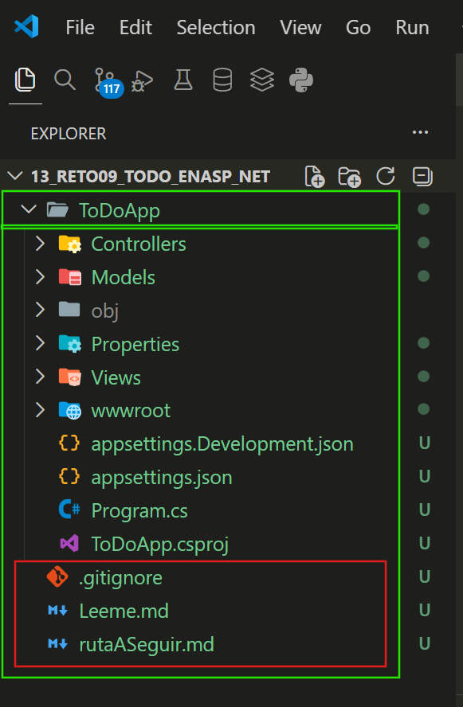
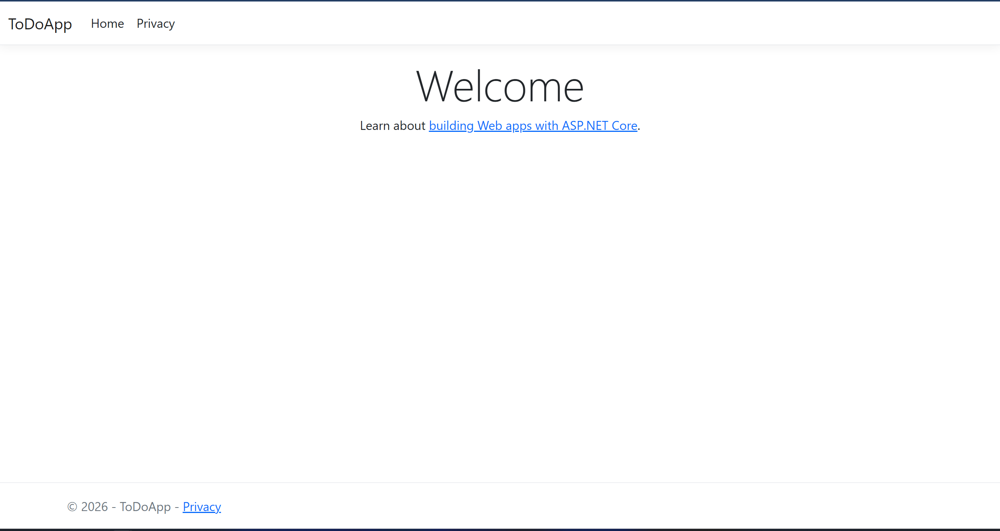
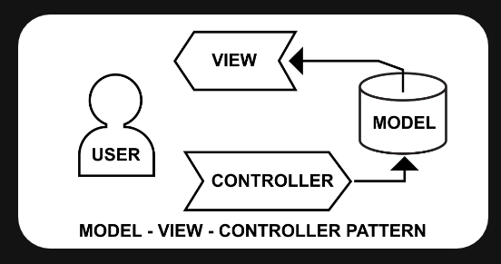
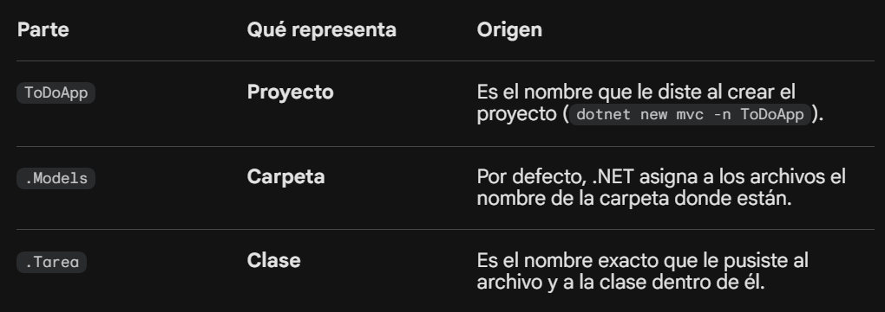

# 🗺️ Ruta Global del Proyecto en forma Macro: Gestor de Tareas (To-Do List) 
Para que no nos perdamos en el bosque de archivos de .NET, seguiremos este orden lógico:

Configuración del Entorno: Preparar VS Code, el SDK de .NET y crear la estructura base del proyecto (MVC - Modelo Vista Controlador).


Definición del Modelo de Datos: Aquí creamos la "columna vertebral". ¿Qué información vamos a guardar?

Configuración de Vistas y Estilos (BEM): Antes de la lógica compleja, armaremos el cascarón visual con HTML y CSS puro siguiendo la metodología BEM.
BEM (Block Element Modifier): Nos obligará a escribir CSS limpio y escalable (ej. .card, .card__title, .card__button--disabled).

Controladores y Acciones: Aquí es donde ocurre la "magia". El controlador recibirá las órdenes del usuario y decidirá qué mostrar.
Junior Style: Evitaremos inyecciones de dependencias complejas o patrones de diseño avanzados (como Repository Pattern) a menos que sea estrictamente necesario para que el código no se rompa. Usaremos Listas en memoria inicialmente para no enredarnos con bases de datos , antes de dar el salto a la base de datos.

📝 Refinando el Modelo de Datos
Nuestro objeto "Tarea" tendrá esta estructura :

Título: ¿Qué hay que hacer?

Asignado a: (Tú, tu esposa, etc.)

Vencimiento: Fecha y Hora.

Ubicación: Nombre del lugar y dirección corta.

Recordatorio: Fecha/Hora para la alerta.

Adjuntos: Ruta del archivo (foto/doc).

Notas: Texto libre.

Estado: ¿Completada o Pendiente?

Fecha de Finalización: Para el histórico.

💾 Sobre la Persistencia (Almacenamiento)

Fase 1: Arreglo en Memoria. Trabajaremos con una List<Tarea>. Es instantáneo, fácil de entender y nos permite centrarnos en la lógica de C# y las vistas HTML/BEM.

Fase 2: SQLite. Es la mejor opción después de la memoria. No requiere instalar nada (es solo un archivo .db en tu carpeta). Es mucho más sencillo que MySQL o Mongo para empezar.

Rutas y Navegación: Configuraremos cómo se llega a cada parte de nuestra web (URLs).

Pruebas y Refinamiento: Ver que todo funcione, corregir errores y comentar a fondo.

¿Por qué este orden? Empezar por el Modelo nos obliga a entender qué datos manejamos antes de intentar mostrarlos. Luego, diseñar la Interfaz con BEM nos permite tener algo tangible que "conectar" mediante los Controladores.

# Empecemos con el entorno : 
( Para abrir la vista previa de este archivo (Markdown ), en VS Code: [Ctrl][Shift] [p] y seleccionar o buscar **MarkDown: Open Preview**

## Crear el directorio para el contenedor del proyecto. 
Cree la carpeta : 13_Reto09_ToDo_EnASP_NET   (con mkdir o explorador de windows)

## SEGURIDAD EN GitHub:  
Cree un archivo .gitignore para que solo suba lo elemental para el proyecto sin comprometer informacion.

Guardar el archivo en el contenedor del proyecto.

# Paso 1: Configuración del Entorno y Andamiaje.

La Lógica de este paso
El objetivo es crear la estructura MVC (Modelo-Vista-Controlador). ¿Por qué MVC? Porque es el estándar de la industria:

Modelos: Donde definiremos cómo es una "Tarea".

Vistas: El HTML que verá el usuario.

Controladores: El "cerebro" que conecta los datos con la pantalla.

🛠️ Acciones en la Terminal
Abre la terminal integrada en VS Code (Ctrl + ñ o Terminal > New Terminal) y asegúrate de estar dentro de tu carpeta 13_Reto09_ToDo_EnASP_NET. Ejecuta los siguientes comandos:

## Crear el proyecto:

---
```bash
dotnet new mvc -n ToDoApp  
```

---  

(Esto crea una subcarpeta llamada ToDoApp con todo el esqueleto inicial).

La parte verde es la Aplicacion ToDoApp. Los archivos en recuadro rojo ya existian en la raiz ( Yo los cree antes)


Entrar a la carpeta del proyecto:

---
```bash
cd ToDoApp
```
Verificar que todo funciona:

---
```bash
dotnet watch run
```
---
(El comando watch es genial para principiantes: cada vez que guardes un cambio en el código, la web se actualizará sola en el navegador).  
Al aplicar dotnet watch run veremos que se abre:


📂 Entendiendo el "Andamiaje" (Estructura de Carpetas)
Una vez creado, verás que VS Code se llenó de archivos. Aquí lo que debes saber ahora:

Controllers/: Aquí vive HomeController.cs. Es el que decide qué página mostrar al entrar a la web.

Models/: Aquí crearemos nuestra clase Tarea en el siguiente paso.

Views/: Aquí están los archivos .cshtml. Son HTML, pero nos permiten usar código C# dentro.

Views/Shared/_Layout.cshtml: Es la "plantilla maestra" (menú, pie de página) que comparten todas las páginas.

wwwroot/: Aquí pondremos nuestro archivo CSS con metodología BEM.

appsettings.json: Donde pondremos la configuración de la base de datos más adelante.

🧩 Extensiones Recomendadas para VS Code
Asegúrate de tener instaladas estas extensiones en VS Code:

C# Dev Kit: Esencial para el autocompletado y depuración.

C# Extensions (de JosKreativ): Te permite crear clases y archivos más rápido con clic derecho.

# Paso 2: El Modelo de Datos.

🧠 La Lógica de este paso
El Modelo es la representación de la realidad en código. Antes de pintar botones o tablas, debemos decirle a la computadora qué es exactamente una "Tarea" para nosotros.

¿Por qué lo hacemos ahora? Porque tanto el Controlador como la Vista necesitan saber qué datos existen. Si el Controlador quiere "guardar una tarea", necesita saber que tiene un campo "Lugar"; si la Vista quiere "mostrar una fecha", necesita que el Modelo se la entregue.

🛠️ Creando nuestra clase Tarea
En el explorador de archivos de VS Code, busca la carpeta Models.

Haz clic derecho sobre la carpeta Models y elige New C# Class (gracias a la extensión C# Extensions (de JosKreativ)) y nómbrala:

 Tarea.cs.

Borra lo que tenga y pega el siguiente código. He incluido todos los campos propuestos:

---
```c#
using System.ComponentModel.DataAnnotations;

namespace ToDoApp.Models;

public class Tarea
{
    // El ID es vital para que C# sepa cuál tarea editar o borrar más adelante
    public int Id { get; set; }

    [Required(ErrorMessage = "El título es obligatorio")]
    [Display(Name = "Qué tarea es?")]
    public string Titulo { get; set; } = string.Empty;

    [Display(Name = "Para quién es?")]
    public string AsignadoA { get; set; } = string.Empty;

    [Display(Name = "Fecha de Vencimiento")]
    [DataType(DataType.DateTime)]
    public DateTime FechaVencimiento { get; set; }

    [Display(Name = "Lugar")]
    public string Lugar { get; set; } = string.Empty;

    [Display(Name = "Dirección")]
    public string Direccion { get; set; } = string.Empty;

    [Display(Name = "Notas adicionales")]
    public string Notas { get; set; } = string.Empty;

    [Display(Name = "¿Está terminada?")]
    public bool EstaCompletada { get; set; } = false;

    [Display(Name = "Fecha de Culminación")]
    public DateTime? FechaCulminacion { get; set; }

    // Guardaremos la ruta del archivo o foto en el servidor
    public string? RutaAdjunto { get; set; }

    // Este campo nos ayudará a saber si hay que generar aviso
    public bool RequiereRecordatorio { get; set; }
}
```
---

🔍 Explicación :
{ get; set; }: Son las "puertas" de acceso. get permite leer el valor y set permite cambiarlo.

string.Empty: Es una buena práctica para evitar que los textos sean "nulos" (que el programa no sepa qué hay ahí) y evitar errores.

DateTime? (con signo de interrogación): Significa que el campo es opcional. Una tarea nueva no tiene "Fecha de Culminación" hasta que la terminas, por eso permitimos que sea nulo al inicio.

[Display(Name = "...")]: Estas son "etiquetas" (Data Annotations). Le dicen a .NET: "Cuando muestres esto en pantalla, no pongas el nombre de la variable FechaVencimiento, pon algo más amigable como Fecha de Vencimiento".

1. Sobre las etiquetas [ ] (Data Annotations)
Esos corchetes son metadatos. Es como ponerle una etiqueta a una caja: no cambian lo que hay dentro de la caja, pero le dicen al resto del sistema cómo tratarla.
Además de [Display] y [Required], existen otros muy útiles:

[StringLength(100)]: Evita que alguien escriba un testamento en el campo "Título".

[Range(1, 5)]: Útil si tuvieras un campo "Prioridad" del 1 al 5.

[EmailAddress]: Valida automáticamente que el texto tenga formato de correo.

2. El reto de los "Múltiples Adjuntos"
Aquí es donde tomamos una decisión de diseño importante.

Tal como definimos el campo public string? RutaAdjunto, el modelo solo puede guardar una ruta (un solo archivo). Si quieres guardar varios, tenemos dos caminos:

Camino A (Nivel Junior): Guardamos los archivos en una carpeta y en el campo de texto del modelo guardamos los nombres separados por comas (ej: "foto1.jpg, acta.pdf"). Es un poco "manual", pero fácil de entender.

Camino B (Nivel Junior+): Creamos una segunda clase llamada Adjunto y hacemos que una Tarea tenga una List<Adjunto>.

Mi recomendación: Para no complicar el Paso 2 y 3 (que es donde se pone difícil la cosa con las bases de datos), mantengamos uno solo por ahora. Una vez que tengamos el sistema funcionando con un archivo, te enseñaré cómo escalarlo a muchos. Es mejor dominar el flujo de "subir un archivo" primero.

🚩 ¿Qué sigue?
Ahora que tenemos el "molde" de nuestra tarea, el siguiente paso lógico sería el Controlador:


# Paso 3: Controladores (La Lógica de Control)
La Lógica de este paso
El Controlador es como el camarero de un restaurante.

El cliente (tú en el navegador) pide algo.

El camarero (Controlador) va a la cocina (Modelo/Base de Datos) a buscar la información.

El camarero te trae el plato preparado (Vista HTML).

En este paso, crear el TareaController.cs. Este archivo tendrá "Acciones" (métodos) para:

Listar las tareas.

Mostrar el formulario para crear una nueva.

Guardar esa tarea en nuestra lista.

🛠️ Preparando el Terreno (Simulación de Datos)
Como aún no tenemos base de datos, crearemos una "Lista estática" para que los datos no se borren cada vez que navegues entre páginas.

Ve a la carpeta Controllers.

Crea un nuevo archivo llamado TareaController.cs.

Pega este código inicial (está preparado para que sea fácil de leer):

---
```c#
using Microsoft.AspNetCore.Mvc;
using ToDoApp.Models; // Importamos nuestro modelo

namespace ToDoApp.Controllers;

public class TareaController : Controller
{
    // Creamos una lista en memoria para guardar las tareas temporalmente
    // Al ser "static", se mantiene viva mientras la app esté corriendo
    private static List<Tarea> _tareas = new List<Tarea>();

    // Acción para listar las tareas (INDEX)
    public IActionResult Index()
    {
        // Ordenamos por fecha de vencimiento antes de enviar a la vista
        var tareasOrdenadas = _tareas.OrderBy(t => t.FechaVencimiento).ToList();
        
        // Pasamos la lista a la Vista
        return View(tareasOrdenadas);
    }

    // Acción para mostrar el formulario de creación (GET)
    public IActionResult Crear()
    {
        return View();
    }

    // Acción para recibir los datos del formulario y guardarlos (POST)
    [HttpPost]
    public IActionResult Crear(Tarea nuevaTarea)
    {
        if (ModelState.IsValid)
        {
            // Asignamos un ID sencillo basado en el conteo
            nuevaTarea.Id = _tareas.Count + 1;
            
            _tareas.Add(nuevaTarea);
            
            // Al terminar, volvemos al listado
            return RedirectToAction("Index");
        }

        // Si hay errores (ej: falta el título), volvemos a mostrar el formulario
        return View(nuevaTarea);
    }
}
```
---

❓ ¿Qué acabamos de hacer?
Definimos una Lista temporal _tareas.

Creamos el método Index:   
que será nuestra pantalla principal.

Creamos dos métodos Crear:  
Uno para ver el formulario y otro (marcado con [HttpPost]) para recibir los datos que el usuario escriba.


Si estás de acuerdo con esta lógica, el siguiente paso será crear la Vista (el HTML) para poder ver esto en el navegador, porque si intentas entrar ahora a /Tarea/Index, te dará un error de "Vista no encontrada".

📝 Notas para cuando retomes el proyecto:
Carpeta Views: Tendremos que crear una carpeta llamada Tarea dentro de Views.

Archivos .cshtml: Crearemos Index.cshtml (para la lista) y Crear.cshtml (para el formulario).

Metodología BEM: Aquí es donde empezaremos a aplicar el estilo CSS que definimos, estructurando las clases como .task-list, .task-card__title, etc.



Un pequeño recordatorio: Como ahora estamos usando una "Lista en memoria" (static List<Tarea>), si detienes por completo el proyecto o reinicias VS Code, los datos que hayas guardado se borrarán. Esto es normal y es lo que solucionaremos más adelante cuando conectemos SQLite.

# EXPLICACION DEL CONTROLLER:

El Controlador como un "Recepcionista"
Imagina que el Controlador es el recepcionista de un hotel (tu aplicación). El recepcionista tiene varias Funciones o Tareas que puede hacer.

public:  
Significa que cualquier persona desde internet puede "llamar" a esa función. Si fuera private, sería una tarea interna que el recepcionista hace a escondidas y nadie desde afuera puede pedir.

IActionResult:   
Es el tipo de respuesta. Significa: "Al final de esta tarea, te voy a entregar un Resultado de Acción" (que casi siempre es una página HTML, pero podría ser un archivo, un error 404, o un salto a otra página).

Entendiendo los nombres de las funciones (Acciones)
Los nombres como Index() o Crear() son los nombres de las Acciones. En la web, estos nombres aparecen en la URL (la dirección del navegador).

1. public IActionResult Index()
Qué hace: Es la acción por defecto. Cuando vas a tuweb.com/Tarea, el sistema busca automáticamente el método Index.

Su lógica: "Voy a buscar la lista de tareas y te entrego la Vista (la página) que las muestra".

2. public IActionResult Crear()
Qué hace: Esta acción se encarga de mostrar el formulario vacío.

Su lógica: "Te entrego una Vista que tiene el formulario en blanco para que lo rellenes".

⚠️ El truco de los "Dos métodos Crear"
Habrás notado en el código anterior que puse Crear() dos veces. ¿Por qué no explota el programa? Por el "Verbo":

El Crear normal (GET): Se activa cuando el usuario entra a la página para ver el formulario. El navegador dice: "Oye, dame (GET) la página de crear".

El Crear con [HttpPost]: Se activa cuando el usuario hace clic en el botón "Guardar". El navegador dice: "Oye, aquí te envío (POST) los datos que el usuario escribió en el formulario".

En resumen:
Controlador: La clase que agrupa tareas relacionadas (Tareas).

Acción (Index, Crear): El nombre específico de la tarea que quieres ejecutar.

IActionResult: La promesa de que, al terminar, el servidor te enviará algo de vuelta (usualmente una página).

### 1. El using ToDoApp.Models;
En C#, el using no importa archivos, importa el Namespace (el nombre de la "familia"). Como dentro de la carpeta Models todos tus archivos dirán namespace ToDoApp.Models;, al poner el using en el controlador, este puede ver a la clase Tarea y a cualquier otra que crees allí en el futuro. Es como abrir una caja y tener acceso a todas las herramientas que hay dentro.

### 2. ¿Qué es realmente IActionResult?
Es una Interface. En programación, una interfaz es como un contrato. IActionResult le dice a .NET: "No importa qué pase aquí adentro, te prometo que al final te devolveré algo que el navegador pueda entender" (una página, una redirección o incluso un error).

    return View(): Cumple el contrato enviando una página HTML.

    return RedirectToAction(): Cumple el contrato enviando al usuario a otra URL.

### 3. La relación mágica: Nombres de Métodos = Archivos
ASP.NET MVC funciona por Convención sobre Configuración.

Si tu controlador se llama **Tarea**Controller.

Y tu método se llama `Index`.

.NET buscará automáticamente un archivo en: Views/**Tarea**/`Index`.cshtml.

No tienes que decirle dónde está el archivo, él lo deduce por el nombre del método.  
**Por eso los nombres deben coincidir exactamente.**  

## Paso 3.1: Creando las Vistas (HTML + BEM)
Ahora vamos a crear la parte visual. Como todavía no tenemos el CSS, el HTML se verá "desnudo", pero aplicaremos la estructura BEM desde ya.

🛠️ Acción 1: Crear la estructura de carpetas
En tu explorador de VS Code:

Ve a la carpeta **Views**.

Crea una nueva carpeta llamada Tarea (Debe llamarse igual que el controlador, pero sin la palabra "Controller").

🛠️ Acción 2: Crear la vista de Listado (Index)
Dentro de Views/Tarea/, crea un archivo llamado Index.cshtml.

Pega este código. Nota cómo usamos C# (con el símbolo @) mezclado con HTML:

---
```html
@model IEnumerable<ToDoApp.Models.Tarea> 
@* El @model le dice a la vista qué tipo de datos va a recibir (una lista de tareas) *@

@{
    ViewData["Title"] = "Mis Tareas";
}

<section class="task-manager">
    <h1 class="task-manager__title">Gestor de Tareas</h1>

    <div class="task-manager__actions">
        @* Este enlace nos llevará al método "Crear" del controlador *@
        <a asp-action="Crear" class="button button--primary">+ Nueva Tarea</a>
    </div>

    <div class="task-list">
        @if (!Model.Any())
        {
            <p class="task-list__empty">No hay tareas pendientes. ¡Disfruta tu día!</p>
        }
        else
        {
            @foreach (var tarea in Model)
            {
                @* Estructura BEM: Bloque (task-card), Elemento (__title) *@
                <article class="task-card @(tarea.EstaCompletada ? "task-card--completed" : "")">
                    <div class="task-card__content">
                        <h3 class="task-card__title">@tarea.Titulo</h3>
                        <p class="task-card__info"><strong>Para:</strong> @tarea.AsignadoA</p>
                        <p class="task-card__info"><strong>Vence:</strong> @tarea.FechaVencimiento.ToShortDateString()</p>
                        <p class="task-card__location">📍 @tarea.Lugar</p>
                    </div>
                </article>
            }
        }
    </div>
</section>
```
---  


🔍 Explicación de la lógica en la Vista:  Index.cshtml
    **@model IEnumerable<...>**:  
    Es la declaración de qué datos entran. Como el controlador envió una lista, aquí la recibimos como una colección (IEnumerable).  
    1. La anatomía de la ruta @model IEnumerable<ToDoApp.Models.Tarea> 

    Es como una dirección postal que va de lo más grande a lo más pequeño:


    
2. ¿Cómo sabe .NET que esa es la ruta?
Si abres tu archivo Models/Tarea.cs, verás que en la primera línea (o cerca de ella) dice:
namespace ToDoApp.Models;

Esa línea es la que define la "dirección oficial" de la clase. No importa tanto en qué carpeta física esté el archivo, sino qué nombre de namespace tenga declarado. Por convención, en .NET, el namespace siempre sigue la estructura NombreProyecto.Carpeta.

3. ¿Por qué en el Controlador usamos using y en la Vista la ruta larga?
Esta es una diferencia de estilo y ubicación:

En el Controlador: Escribimos using ToDoApp.Models; arriba de todo para no tener que escribir la ruta larga cada vez que mencionamos a Tarea.

En la Vista: Las vistas son un poco más "aisladas". Aunque podrías usar un @using, lo más común y limpio para el modelo principal es decirle exactamente de dónde viene con la ruta completa para evitar que .NET se confunda con otras clases que se llamen igual.

💡 Un truco para el nivel Junior
Si alguna vez olvidas la ruta, solo ve al archivo donde definiste la clase (Tarea.cs) y mira qué dice después de la palabra namespace. A eso solo le añades un punto . y el nombre de la clase.

Dato curioso: IEnumerable significa que lo que vas a recibir es una "Colección" o "Lista" de esa dirección. Es como decir: "No me traigas una Tarea, tráeme un contenedor donde vengan muchas Tareas".


asp-action="Crear": Esto es un Tag Helper. .NET lo convertirá automáticamente en un link  
---
```html
<a href="/Tarea/Crear">.
```
---

@foreach: Es un bucle que crea una "tarjeta" de HTML por cada tarea que exista en la lista.

BEM en acción: Fíjate en las clases task-card (bloque), task-card__title (elemento) y task-card--completed (modificador).

¡Excelente! Seguimos con el Formulario de Creación. Es la mejor forma de ver cómo los datos que escribes en el navegador terminan convertidos en un objeto de C#.

## DATOS A RECIBIR EN LA VISTA
Puntos importantes sobre  `@model`, que son fundamentales:

    1. ¿Es obligatorio indicar el `@model`?
    No es obligatorio, pero es altamente recomendado.

    Si no lo pones, la vista es "dinámica" y no tiene autocompletado.

    Si lo pones (como hicimos con IEnumerable<...>), VS Code te ayudará avisándote si escribes mal un campo  ej. si pones @tarea.Titullo en lugar de Titulo, te marcará un error antes de ejecutar la web).

    2. Tipos de datos usuales en una vista
    Una sola Clase: @model ToDoApp.Models.Tarea (Para la vista de "Detalles" o "Editar").

    Una Lista: @model IEnumerable<ToDoApp.Models.Tarea> (Para el "Index" o listados).

    Tipos básicos: @model string o @model int (Raro, pero posible).

    3. ¿Qué pasa si la vista necesita recibir distintos tipos? (Ej: Tareas + Categorías)
    En ese caso usamos lo que llamamos un ViewModel. Es una clase que creamos solo para la vista y que "empaqueta" todo lo que necesitamos. Es como una caja que dentro lleva un objeto Tarea, una lista de Categorias y quizás un MensajeDelDia.

## Paso 3.2: La Vista de Creación (Crear.cshtml)
La Lógica de este paso
Aquí usaremos Tag Helpers (asp-for). Estos conectan cada input del HTML directamente con una propiedad de nuestro Modelo. Así, cuando el usuario escribe en el cuadro de "Lugar", .NET sabe que eso debe guardarse en la variable Lugar.

Dentro de la carpeta Views/Tarea/, crea el archivo Crear.cshtml.


---
```html
@model ToDoApp.Models.Tarea
@* Aquí recibimos una Tarea individual, no una lista, porque vamos a crear UNA *@

@{
    ViewData["Title"] = "Nueva Tarea";
}

<section class="task-form">
    <h1 class="task-form__title">Agregar Nueva Tarea</h1>

    @* El asp-action="Crear" le dice al formulario que al presionar enviar, 
       busque el método [HttpPost] Crear en el controlador *@
    <form asp-action="Crear" method="post" class="form">
        
        @* Título *@
        <div class="form__group">
            <label asp-for="Titulo" class="form__label"></label>
            <input asp-for="Titulo" class="form__input" />
            <span asp-validation-for="Titulo" class="form__error"></span>
        </div>

        @* Asignado a *@
        <div class="form__group">
            <label asp-for="AsignadoA" class="form__label"></label>
            <input asp-for="AsignadoA" class="form__input" />
        </div>

        @* Fecha de Vencimiento *@
        <div class="form__group">
            <label asp-for="FechaVencimiento" class="form__label"></label>
            <input asp-for="FechaVencimiento" class="form__input" type="datetime-local" />
        </div>

        @* Lugar *@
        <div class="form__group">
            <label asp-for="Lugar" class="form__label"></label>
            <input asp-for="Lugar" class="form__input" />
        </div>

        @* Notas *@
        <div class="form__group">
            <label asp-for="Notas" class="form__label"></label>
            <textarea asp-for="Notas" class="form__textarea"></textarea>
        </div>

        <div class="form__actions">
            <button type="submit" class="button button--success">Guardar Tarea</button>
            <a asp-action="Index" class="button button--link">Cancelar</a>
        </div>
    </form>
</section>


@section Scripts {
    @* Esto activa las validaciones del lado del cliente para que no se envíe 
       el formulario si faltan campos obligatorios *@
    @{await Html.RenderPartialAsync("_ValidationScriptsPartial");}
}
```
---


🔍 ¿Qué está pasando aquí?  
asp-for="Titulo":  
.NET lee las etiquetas [Display(Name="...")] que pusimos en el Modelo (Paso 2) y automáticamente pone ese texto en el <label>.

type="datetime-local":  
Le dice al navegador que muestre un selector de fecha y hora profesional.

asp-validation-for:  
Si intentas guardar sin título, .NET pondrá un mensaje de error automáticamente sin que tú programes validaciones manuales.  

## ⚠️ El siguiente gran paso: ¡Probar la interactividad!
Si tienes el **dotnet watch run** activo, Ve a tu navegador.

Escribe en la barra de direcciones: http://localhost:XXXX/Tarea/Crear.

Rellena los datos y dale a Guardar.

¿Qué debería pasar?
El controlador recibirá la tarea, la meterá en la lista estática y te redirigirá al Index. Como el Index tiene el @foreach, ¡ahora deberías ver tu tarea listada!


## Paso 5: Interfaz de Usuario (CSS con BEM).

🎨 La Lógica de este paso
Usaremos el método BEM (Block, Element, Modifier). Esto nos permite escribir CSS que no se vuelve un caos cuando el proyecto crece.

Bloque (task-card): El contenedor principal.

Elemento (task-card__title): Una parte interna que no tiene sentido sola.

Modificador (task-card--completed): Una versión diferente del bloque (ej. cambiar el color si está lista).

🛠️ Aplicando los Estilos
En VS Code, ve a la carpeta wwwroot/css.

Abre el archivo site.css.

Borra todo lo que tiene (es el estilo de ejemplo de .NET) y pega este código que he diseñado específicamente para nuestras clases BEM:

---
```css
/* 1. Estilos Base */
body {
    font-family: 'Segoe UI', Tahoma, Geneva, Verdana, sans-serif;
    background-color: #f4f7f6;
    color: #333;
    line-height: 1.6;
}

/* 2. Bloque: task-manager (El contenedor principal) */
.task-manager {
    max-width: 800px;
    margin: 2rem auto;
    padding: 0 1rem;
}

.task-manager__title {
    color: #2c3e50;
    text-align: center;
    border-bottom: 3px solid #3498db;
    padding-bottom: 0.5rem;
}

/* 3. Bloque: task-card (Cada tarea) */
.task-list {
    display: grid;
    gap: 1.5rem;
    margin-top: 2rem;
}

.task-card {
    background: white;
    border-left: 5px solid #3498db;
    border-radius: 8px;
    padding: 1.5rem;
    box-shadow: 0 4px 6px rgba(0,0,0,0.1);
    transition: transform 0.2s;
}

.task-card:hover {
    transform: translateY(-5px);
}

.task-card__title {
    margin-top: 0;
    color: #2980b9;
    font-size: 1.4rem;
}

.task-card__info {
    margin: 0.3rem 0;
    font-size: 0.95rem;
}

.task-card__location {
    color: #e67e22;
    font-weight: bold;
    font-size: 0.9rem;
}

/* 4. Modificador: Tarea completada */
.task-card--completed {
    border-left-color: #27ae60;
    opacity: 0.7;
}

/* 5. Botones */
.button {
    display: inline-block;
    padding: 0.8rem 1.5rem;
    border-radius: 5px;
    text-decoration: none;
    font-weight: bold;
    cursor: pointer;
    border: none;
}

.button--primary {
    background-color: #3498db;
    color: white;
}

.button--success {
    background-color: #27ae60;
    color: white;
}

/* 6. Formulario */
.form__group {
    margin-bottom: 1.2rem;
    display: flex;
    flex-direction: column;
}

.form__label {
    font-weight: bold;
    margin-bottom: 0.4rem;
}

.form__input, .form__textarea {
    padding: 0.6rem;
    border: 1px solid #ccc;
    border-radius: 4px;
}
```
---

## 🔗 Un último detalle: El Menú Superior
Para que no tengas que escribir la URL /Tarea a mano, vamos a modificar el menú de navegación.

Ve a Views/Shared/_Layout.cshtml.

Busca donde dice asp-controller="Home" asp-action="Index".

Cámbialo por asp-controller="Tarea" asp-action="Index".

Cambia el texto de "Home" a "Mis Tareas".

🧐 ¿Qué observar ahora?
Si guardas los cambios, verás que tus tareas ahora aparecen dentro de tarjetas blancas con sombra, con una franja azul a la izquierda y una tipografía más limpia. El botón de "+ Nueva Tarea" ahora debería parecer un botón de verdad.

## Paso 4: Rutas y Acciones (Interactividad)
Ahora que se ve bien, vamos a hacer que sea útil. Una lista de tareas no sirve de mucho si no podemos marcarlas como "Hechas".

La Lógica de este paso: El "Modificador" de BEM
¿Recuerdas que en el CSS pusimos .task-card--completed?

Si la propiedad EstaCompletada es true, la tarjeta debe cambiar de color (verde) y quizás tachar el texto.

Necesitamos una Acción en el controlador que busque la tarea por su Id y le cambie el estado.

🛠️ Acción 1: El Controlador
Abre TareaController.cs y añade este nuevo método al final de la clase:

---
```c#  

// Acción para marcar como completada
// Recibimos el ID de la tarea que queremos modificar
public IActionResult MarcarComoCompletada(int id)
{
    // Buscamos la tarea en nuestra lista estática por su ID
    var tarea = _tareas.FirstOrDefault(t => t.Id == id);

    if (tarea != null)
    {
        // Cambiamos el estado al contrario del que tenga
        tarea.EstaCompletada = !tarea.EstaCompletada;
        
        // Si se completa, guardamos la fecha de hoy
        if(tarea.EstaCompletada) {
            tarea.FechaCulminacion = DateTime.Now;
        }
    }

    // Regresamos al listado para ver el cambio
    return RedirectToAction("Index");
}
```
---

🛠️ Acción 2: La Vista (Index)
Ahora necesitamos un botón o link en cada tarjeta para disparar esa acción. Abre Index.cshtml y busca el lugar dentro del @foreach. Añadiremos un botón al final de cada task-card__content:

```html
<div class="task-card__content">
    <h3 class="task-card__title">@tarea.Titulo</h3>
    @* ... (tus otros campos de información) ... *@

    <div class="task-card__actions">
        <a asp-action="MarcarComoCompletada" 
           asp-route-id="@tarea.Id" 
           class="button @(tarea.EstaCompletada ? "button--success" : "button--primary")">
            @(tarea.EstaCompletada ? "Reabrir" : "Completar")
        </a>
    </div>
</div>  
```
🔍 ¿Qué es asp-route-id?
Es un Tag Helper que le dice a .NET: "Cuando crees el link, añade al final el ID de esta tarea específica".

El HTML resultante será algo como:  

```html  
<a href="/Tarea/MarcarComoCompletada/1">.  
```

Así, cuando haces clic, el controlador sabe exactamente a qué tarea le estás dando órdenes.

🎨 Ajuste en el CSS (BEM)
Para que se note el cambio visual, asegúrate de que en tu site.css tengas algo así para el texto tachado (añádelo si no está):

---
```css
.task-card--completed .task-card__title {
    text-decoration: line-through;
    color: #7f8c8d;
}

.task-card--completed {
    border-left-color: #27ae60; /* Verde */
    background-color: #f9f9f9;
}  
```
---
🚩 Prueba:
Crea una tarea nueva.

Haz clic en el botón "Completar".

Debería cambiar a color verde, tacharse el título y el botón debería decir ahora "Reabrir".

# CAMPOS REQUERIDOS EN LA BASE DE DATOS.
En el formulario de entrada ( Por ejemplo de nueva Tarea) me di cuenta que NO dejaba Guardar la Tarea sin escribir algo en el textArea de las notas.  
El campo, en el Models.Tarea ( Archivo Tarea.cs dentro de la carpeta Models) estaba definido asi:

Modifique Models/Tarea.cs a:
Por ejemplo antes tenia:

 public string Notas { get; set; } = string.Empty;  
   
y ahora, añadí el signo ? despues del tipo de dato string , es decir string?.  Eso significa que puede ser nulo.  
 public string? Notas { get; set; } = string.Empty;

**La explicacion tecnica:**  
En .NET 6, 7 y 8, se introdujo una característica llamada "Nullable Reference Types".  
La razón: Si en  modelo Tarea.cs definismos public string Notas { get; set; } sin el signo de interrogación ?, **.NET asume que no puede ser nulo.** Por eso el formulario te bloquea.

La solución: Ve a Models/Tarea.cs y asegúrate de que los campos opcionales tengan el ? y un valor por defecto si es necesario:


---
```c#
using System.ComponentModel.DataAnnotations;

namespace ToDoApp.Models;

public class Tarea
{
    // El ID es vital para que C# sepa cuál tarea editar o borrar más adelante
    public int Id { get; set; }

    [Required(ErrorMessage = "El título es obligatorio")]
    [Display(Name = "Qué tarea es?")]
    public string Titulo { get; set; } = string.Empty;

    [Display(Name = "Para quién es?")]
     // el ? permite que sea nulo y = string.Empty evita errores de sistema):
    // Sino se coloca el ? asume que el campo es Requerido en el formulario de entrada de datos
    public string? AsignadoA { get; set; } = string.Empty;

    [Display(Name = "Fecha de Vencimiento")]
    [DataType(DataType.DateTime)]
    public DateTime FechaVencimiento { get; set; }

    [Display(Name = "Lugar")]
     // el ? permite que sea nulo y = string.Empty evita errores de sistema):
    // Sino se coloca el ? asume que el campo es Requerido en el formulario de entrada de datos
    public string? Lugar { get; set; } = string.Empty;

    [Display(Name = "Dirección")]
     // el ? permite que sea nulo y = string.Empty evita errores de sistema):
    // Sino se coloca el ? asume que el campo es Requerido en el formulario de entrada de datos
    public string? Direccion { get; set; } = string.Empty;

    [Display(Name = "Notas adicionales")]
    // el ? permite que sea nulo y = string.Empty evita errores de sistema):
    // Sino se coloca el ? asume que el campo es Requerido en el formulario de entrada de datos
    public string? Notas { get; set; } = string.Empty;


    [Display(Name = "¿Está terminada?")]
    public bool EstaCompletada { get; set; } = false;

    [Display(Name = "Fecha de Culminación")]
    public DateTime? FechaCulminacion { get; set; }

    // Guardaremos la ruta del archivo o foto en el servidor
    public string? RutaAdjunto { get; set; }

    // Este campo nos ayudará a saber si hay que generar aviso
    public bool RequiereRecordatorio { get; set; }
}
```
---

# Footer rebelde:  "© 2026 - ToDoApp - Privacy" 
Problema:  
Al hacer scroll en la pantalla , el "© 2026 - ToDoApp - Privacy" No se mantenia en la parte de abajo de la pantalla sino que se desplaza ....Al darle zoom o quitarle zoom se ve cambio en la posición: Si le bajo el zoom ( poner todo mas pequeño) si se va al final, después de las tareas. 

El problema del footer (pie de página) es que el layout por defecto de .NET usa unas clases de Bootstrap que a veces chocan con nuestro diseño personalizado. Queremos un "Sticky Footer" (que se quede al fondo si hay poco contenido, pero que se deje empujar hacia abajo si hay muchas tareas).

La IA me sugirió añadir esto a tu site.css sin embargo finalmente añadi solo la parte que no esta comentada, es decir, solucioné con solo CSS en la etiqueta html y al body le añadí el margin-bottom.

---
```css
/* Ajuste para que el cuerpo ocupe al menos el alto de la pantalla */

html {
  position: relative;
  min-height: 100%;
}

body {
  margin-bottom: 60px; /* Altura del footer */
  /* display: flex;
  flex-direction: column; */
}

/* .footer {
  position: absolute;
  bottom: 0;
  width: 100%;
  white-space: nowrap;
  line-height: 60px;
  background-color: #fff;
  border-top: 1px solid #ddd;
  text-align: center;
} */
```
---

3. Filtros y Búsquedas (La lógica del "Siguiente Nivel")
Para implementar los filtros (Activas, Completadas, Todas) y el orden, necesitamos modificar nuestra Acción Index en el Controlador.

La lógica: El navegador le enviará un "parámetro" al controlador (ej: /Tarea?mostrar=completadas). El controlador leerá ese parámetro y filtrará la lista antes de mandarla a la vista.

🛠️ Modificando el Controlador (TareaController.cs)
Reemplaza tu método `Index` por este más inteligente: ( El original lo comenté).


---
```c#
public IActionResult Index(string filtro, string orden)
{
    // Empezamos con todas las tareas
    IEnumerable<Tarea> tareasFiltradas = _tareas;

    // 1. Lógica de Filtrado
    switch (filtro)
    {
        case "activas":
            tareasFiltradas = tareasFiltradas.Where(t => !t.EstaCompletada);
            break;
        case "completadas":
            tareasFiltradas = tareasFiltradas.Where(t => t.EstaCompletada);
            break;
    }

    // 2. Lógica de Orden
    tareasFiltradas = orden switch
    {
        "nombre" => tareasFiltradas.OrderBy(t => t.Titulo),
        "persona" => tareasFiltradas.OrderBy(t => t.AsignadoA),
        _ => tareasFiltradas.OrderBy(t => t.FechaVencimiento) // Por defecto: Fecha
    };

    // Guardamos los valores actuales para que los selectores en la vista no se reseteen
    ViewBag.FiltroActual = filtro;
    ViewBag.OrdenActual = orden;

    return View(tareasFiltradas.ToList());
}
```
---

🛠️ Modificando la Vista (Index.cshtml)
Añadiremos los controles arriba de la lista para poder filtrar:

---
```html
<div class="task-manager__filters">
    <form asp-action="Index" method="get" class="filter-form">
        <select name="filtro" onchange="this.form.submit()">
            <option value="todas">Todas las tareas</option>
            <option value="activas">Solo Activas</option>
            <option value="completadas">Solo Completadas</option>
        </select>

        <select name="orden" onchange="this.form.submit()">
            <option value="fecha">Ordenar por Fecha</option>
            <option value="nombre">Ordenar por Nombre</option>
            <option value="persona">Ordenar por Persona</option>
        </select>
    </form>
</div>
```
---

# Ordenar tareas 
Ordenamiento secundario. Es muy común: si el primer criterio empata, el sistema necesita un "desempatador" para saber qué poner primero.

En .NET (LINQ), esto se hace de forma muy elegante usando la instrucción .ThenBy().

🛠️ Modificación en el Controlador (TareaController.cs)
Vamos a ajustar el bloque switch de tu lógica de ordenamiento. La lógica será: "Ordena por X, y después de eso (ThenBy), ordena por Fecha de Vencimiento".

Reemplaza bloque 2 Logica de orden  por este:

---
```c#
// 2. Lógica de Orden con "Desempatador" ( Ordena por 2 criterios )
        tareasFiltradas = orden switch
        {
            // Ordena por Título; si son iguales, ordena por Fecha de Vencimiento
            "nombre" => tareasFiltradas.OrderBy(t => t.Titulo).ThenBy(t => t.FechaVencimiento),

            // Ordena por Persona; si son iguales, ordena por Fecha de Vencimiento
            "persona" => tareasFiltradas.OrderBy(t => t.AsignadoA).ThenBy(t => t.FechaVencimiento),

            // Por defecto: solo por Fecha de Vencimiento
            _ => tareasFiltradas.OrderBy(t => t.FechaVencimiento)
        };
```
---


🔍 ¿Por qué usamos ThenBy?
OrderBy: Crea el orden inicial. Si lo usaras dos veces seguidas (ej. OrderBy(Titulo).OrderBy(Fecha)), el segundo OrderBy borraría el efecto del primero.

ThenBy: Le dice a .NET: "Mantén los grupos que ya ordenaste y, dentro de esos grupos, aplica este nuevo criterio".

# Paso 5.2: Adjuntar Archivos (Fotos/Documentos)
Este es un paso emocionante porque vamos a interactuar con el sistema de archivos.

🧠 La Lógica de este paso
Subir un archivo no es como subir un texto. Un archivo es un flujo de datos binarios.

En la Vista:  
El formulario debe avisar al navegador: "Oye, voy a enviar datos pesados" (enctype).

En el Controlador:  
Recibiremos el archivo como un objeto IFormFile.

En el Servidor:  
Debemos guardar el archivo físicamente en una carpeta y guardar solo la ruta (el nombre del archivo) en nuestro modelo Tarea.

🛠️ Acción 1:  
Preparar la Carpeta de Destino
Por seguridad y orden, los archivos públicos en .NET deben vivir dentro de la carpeta wwwroot.

Dentro de **wwwroot**, crea una carpeta llamada **uploads**.

🛠️ Acción 2: Modificar la Vista de Creación (Crear.cshtml)
Necesitamos añadir el campo de archivo y preparar el formulario.

Abre Crear.cshtml.

Modifica la etiqueta 

---
```html
<form> 
```    
---

añadiendo el atributo enctype:

---
```html
<form asp-action="Crear" method="post" enctype="multipart/form-data" class="form">
```
---

Añade el campo para el archivo (antes de los botones):


---
```html
<div class="form__group">
    <label class="form__label">Adjuntar Foto o Documento</label>
    <input type="file" name="archivoAdjunto" class="form__input" />
</div>  
```
---

🛠️ Acción 3: Lógica en el Controlador (TareaController.cs)
Aquí viene el "Nivel Junior+". Vamos a modificar el método Crear (el que tiene [HttpPost]) para que reciba el archivo.

---
```c#

[HttpPost]
public IActionResult Crear(Tarea nuevaTarea, IFormFile archivoAdjunto)
{
    if (ModelState.IsValid)
    {
        // 1. Lógica para guardar el archivo si el usuario subió uno
        if (archivoAdjunto != null && archivoAdjunto.Length > 0)
        {
            // Creamos un nombre único para el archivo para que no se sobrescriban
            string nombreUnico = Guid.NewGuid().ToString() + "_" + archivoAdjunto.FileName;
            
            // Definimos la ruta física donde se guardará (wwwroot/uploads)
            string rutaCarpeta = Path.Combine(Directory.GetCurrentDirectory(), "wwwroot/uploads");
            string rutaCompleta = Path.Combine(rutaCarpeta, nombreUnico);

            // Guardamos el archivo físicamente
            using (var stream = new FileStream(rutaCompleta, FileMode.Create))
            {
                archivoAdjunto.CopyTo(stream);
            }

            // Guardamos el NOMBRE del archivo en nuestra Tarea
            nuevaTarea.RutaAdjunto = nombreUnico;
        }

        // 2. Guardar la tarea (lo que ya hacíamos)
        nuevaTarea.Id = _tareas.Count + 1;
        _tareas.Add(nuevaTarea);
        
        return RedirectToAction("Index");
    }
    return View(nuevaTarea);
}  
```
---


🔍 Explicación de los nuevos conceptos:
IFormFile:  
Es la interfaz que usa .NET para capturar archivos del navegador.

Guid.NewGuid():  
Crea un código aleatorio (ej: a1b2-c3d4...). Esto es vital: si dos usuarios suben una foto llamada "receta.jpg", el GUID evita que una borre a la otra.

Path.Combine:  
Es la forma segura de crear rutas de carpetas. Funciona igual en Windows, Linux o Mac.

using (var stream...):  
Es un túnel de datos. El using asegura que una vez se termine de escribir el archivo, el túnel se cierre y no consuma memoria.


# Vamos ahora a mostrar esa imagen en la tarjeta de la tarea (el Index).

🧠 La Lógica de este paso
Ruta relativa:  
En la web, para mostrar una imagen que está en wwwroot/uploads, usamos la ruta /uploads/nombre_archivo.png. El navegador entiende que wwwroot es la raíz.

Miniatura con BEM:  
Crearemos un nuevo elemento de BEM llamado **task-card__attachment**.

Enlace para abrir:  
Envolveremos la imagen en un link <a href="..." target="_blank"> para que, al hacer clic, se abra en una pestaña nueva a tamaño completo.

🛠️ Acción 1:  
Modificar la Vista Index.cshtml
Busca dentro de tu bucle @foreach en el archivo Index.cshtml. Vamos a añadir la lógica para mostrar el adjunto justo antes de cerrar el task-card__content.

---
```html
<div class="task-card__content">
    <h3 class="task-card__title">@tarea.Titulo</h3>
    @* ... (tus otros campos) ... *@

    @* Lógica para el Adjunto *@
    @if (!string.IsNullOrEmpty(tarea.RutaAdjunto))
    {
        <div class="task-card__attachment">
            <a href="~/uploads/@tarea.RutaAdjunto" target="_blank" title="Clic para ver archivo">
                @if (tarea.RutaAdjunto.EndsWith(".png") || tarea.RutaAdjunto.EndsWith(".jpg") || tarea.RutaAdjunto.EndsWith(".jpeg"))
                {
                    
                }
                else
                {
                    @* Si no es imagen (ej. un PDF), mostramos un texto o icono *@
                    <span class="button button--link">📎 Ver Documento</span>
                }
            </a>
        </div>
    }

    <div class="task-card__actions">
        @* ... (tu botón de completar) ... *@
    </div>
</div>  

```
---

🎨 Acción 2: Estilos CSS (BEM)
Para que la imagen no se vea gigante y mantenga el diseño, añade esto a tu site.css:

CSS
/* Elemento: Contenedor del adjunto */
.task-card__attachment {
    margin: 1rem 0;
    padding-top: 0.5rem;
    border-top: 1px dashed #ddd;
}

/* Elemento: La miniatura de la imagen */
.task-card__image-preview {
    max-width: 150px; /* Tamaño de miniatura */
    max-height: 100px;
    border-radius: 4px;
    border: 1px solid #eee;
    display: block;
    transition: transform 0.3s;
}

.task-card__image-preview:hover {
    transform: scale(1.05); /* Pequeño efecto de zoom al pasar el mouse */
    cursor: zoom-in;
}
🔍 ¿Qué significan los símbolos ~ y target="_blank"?
~ (Tilde): En ASP.NET, este símbolo significa "la raíz de la carpeta web" (que es wwwroot). Es muy útil porque si luego subes tu web a un servidor real, las rutas no se romperán.

target="_blank": Es HTML estándar para decirle al navegador: "Abre este enlace en una pestaña nueva", así el usuario no pierde de vista su lista de tareas.

🧠 La Lógica de "Abrir vs Descargar" un archivo anexo que no sea una imagen o pdf ( Por ejemplo un word o excel)
Aquí entra en juego cómo funciona el navegador (Chrome, Edge, etc.) y no tanto el código C#.

Imágenes y PDFs: Los navegadores modernos tienen "visores" integrados. Por eso los abren directamente.

Archivos de Office (.docx, .xlsx): El navegador no sabe "dibujar" un Word por sí mismo, así que su reacción por defecto es descargarlo para que tu computadora lo abra con la aplicación local.

¿Se puede abrir directo? Para que un Word se abra en el navegador sin descargarse, necesitaríamos integrar servicios externos (como Google Docs Viewer o Office 365 Viewer). Como eso es nivel "Senior" y requiere que la web sea pública, por ahora aceptaremos la descarga como el comportamiento estándar para documentos no-visuales.

# EDITAR UNA TAREA
🛠️ Paso 4.2: La Acción de Editar (Controlador)
En TareaController.cs, necesitamos dos métodos (igual que en Crear): uno para ver el formulario con los datos viejos y otro para recibir los datos nuevos.

---
```C#
// 1. Mostrar el formulario con los datos actuales (GET)
public IActionResult Editar(int id)
{
    var tarea = _tareas.FirstOrDefault(t => t.Id == id);
    if (tarea == null) return NotFound();

    return View(tarea); // Le pasamos la tarea encontrada a la vista
}

// 2. Recibir los cambios y guardarlos (POST)
[HttpPost]
public IActionResult Editar(Tarea tareaEditada, IFormFile? nuevoAdjunto)
{
    if (ModelState.IsValid)
    {
        var tareaOriginal = _tareas.FirstOrDefault(t => t.Id == tareaEditada.Id);
        
        if (tareaOriginal != null)
        {
            // Actualizamos los campos uno a uno
            tareaOriginal.Titulo = tareaEditada.Titulo;
            tareaOriginal.AsignadoA = tareaEditada.AsignadoA;
            tareaOriginal.FechaVencimiento = tareaEditada.FechaVencimiento;
            tareaOriginal.Lugar = tareaEditada.Lugar;
            tareaOriginal.Notas = tareaEditada.Notas;

            // Lógica para el adjunto (si sube uno nuevo, reemplazamos el anterior)
            if (nuevoAdjunto != null && nuevoAdjunto.Length > 0)
            {
                // (Opcional) Aquí podrías borrar el archivo anterior físicamente
                string nombreUnico = Guid.NewGuid().ToString() + "_" + nuevoAdjunto.FileName;
                string ruta = Path.Combine(Directory.GetCurrentDirectory(), "wwwroot/uploads", nombreUnico);
                
                using (var stream = new FileStream(ruta, FileMode.Create))
                {
                    nuevoAdjunto.CopyTo(stream);
                }
                tareaOriginal.RutaAdjunto = nombreUnico;
            }
        }
        return RedirectToAction("Index");
    }
    return View(tareaEditada);
}  

```
---

# VISTA DE EDICION:

🛠️ Paso 4.2: La Vista de Edición (Editar.cshtml)
Crea un archivo Editar.cshtml en Views/Tarea/.

Truco Junior: El código es casi idéntico al de Crear.cshtml. La única diferencia vital es que necesitamos un campo oculto para el Id.

---
```c#
@model ToDoApp.Models.Tarea

<section class="task-form">
    <h1 class="task-form__title">Editar Tarea</h1>

    <form asp-action="Editar" method="post" enctype="multipart/form-data" class="form">
        @* Campos ocultos vitales *@
        <input type="hidden" asp-for="Id" />
        <input type="hidden" asp-for="RutaAdjunto" />

        <div class="form__group">
            <label asp-for="Titulo" class="form__label"></label>
            <input asp-for="Titulo" class="form__input" />
        </div>

        <div class="form__group">
            <label asp-for="AsignadoA" class="form__label"></label>
            <input asp-for="AsignadoA" class="form__input" />
        </div>

        <div class="form__group">
            <label asp-for="FechaVencimiento" class="form__label"></label>
            <input asp-for="FechaVencimiento" class="form__input" type="datetime-local" />
        </div>

        <div class="form__group">
            <label asp-for="Lugar" class="form__label"></label>
            <input asp-for="Lugar" class="form__input" />
        </div>

        <div class="form__group">
            <label asp-for="Direccion" class="form__label"></label>
            <input asp-for="Direccion" class="form__input" />
        </div>

        <div class="form__group">
            <label asp-for="Notas" class="form__label"></label>
            <textarea asp-for="Notas" class="form__textarea"></textarea>
        </div>

        <div class="form__group">
            <label class="form__label">Cambiar Adjunto (Opcional)</label>
            <input type="file" name="nuevoAdjunto" class="form__input" />
            @if (!string.IsNullOrEmpty(Model.RutaAdjunto)) {
                <p><small>Archivo actual: @Model.RutaAdjunto</small></p>
            }
        </div>

        <div class="form__actions">
            <button type="submit" class="button button--success">Guardar Cambios</button>
            <a asp-action="Index" class="button button--link">Cancelar</a>
        </div>
    </form>
</section>
```
---


🛠️ Paso 4.2: El Botón en el Listado (Index.cshtml)
Ahora sí, vamos a añadir el botón de Editar en cada tarjeta, al lado de los otros:

---
```html
<div class="task-card__actions">
    @* Botón de Editar *@
    <a asp-action="Editar" asp-route-id="@tarea.Id" class="button button--secondary">
       Editar
    </a>

    @* ... (tus otros botones de Completar y Borrar) ... *@
</div>  
```
---


Y un pequeño ajuste en el CSS para ese nuevo botón:

---
```css
.button--secondary {
    background-color: #95a5a6;
    color: white;
}  
```
---


## 🧐 ¿Por qué el input type="hidden"? en Editar.cshtml
Esta es la parte clave del Update. Cuando el servidor te envía el formulario de edición, te manda los datos de la Tarea #5. Pero cuando tú le das a "Guardar", el servidor recibe un paquete de datos nuevo. Si no incluyes el ID de forma oculta, el servidor dirá: "Recibí estos datos, pero no tengo ni idea de a qué número de tarea pertenecen".

# Ajuste de separacion Index.cshtml filtros y orden
Estaban muy juntos asi que hice un pequeño ajuste en el CSS ( wwwroot/css/site.css) en la class="task-manager__filters" que se corresponde al bloque para seleccionar los parametros para ordenar y/o filtrar las tareras

Un ajuste muy pequeño...darle margen en la parte superior para separarlo del boton de Agregar tarea.
---
```css
/*  Bloque de Filtro y ordenar en Index.cshtml */
.task-manager__filters  {
margin-top:15px;

}
```
---

# AJUSTE DEL ARCHIVO TareaaController.cs para incluir el campo Direccion que se habia quedado fuera de la inclusion al añadir o editar una Tarea.


# La Acción de Borrar un registro - Una Tarea (Limpieza Total)
Para cerrar el ciclo básico, necesitamos poder eliminar tareas. Hay un detalle importante: Al borrar la tarea, si tiene un anexo, el archivo en wwwroot/uploads no se borra solo. Si no tenemos cuidado, el servidor se llenará de archivos huérfanos.

🛠️ Acción 1: El Controlador (TareaController.cs)
Añadiremos un método que primero borre el archivo físico y luego la tarea de la lista.

---
```C#
public IActionResult Borrar(int id)
{
    // 1. Buscar la tarea
    var tarea = _tareas.FirstOrDefault(t => t.Id == id);

    if (tarea != null)
    {
        // 2. Si tiene un archivo adjunto, hay que borrarlo del disco duro
        if (!string.IsNullOrEmpty(tarea.RutaAdjunto))
        {
            string rutaArchivo = Path.Combine(Directory.GetCurrentDirectory(), "wwwroot/uploads", tarea.RutaAdjunto);
            
            if (System.IO.File.Exists(rutaArchivo))
            {
                System.IO.File.Delete(rutaArchivo);
            }
        }

        // 3. Borrar la tarea de la lista
        _tareas.Remove(tarea);
    }

    return RedirectToAction("Index");
}  
```
---

🛠️ Acción 2: La Vista (Index.cshtml)
Añadiremos el botón de borrar al lado del de completar. Usaremos un modificador de BEM para que el botón sea rojo (button--danger).

---
´´´html
<div class="task-card__actions">
    <a asp-action="MarcarComoCompletada" asp-route-id="@tarea.Id" 
       class="button @(tarea.EstaCompletada ? "button--success" : "button--primary")">
        @(tarea.EstaCompletada ? "Reabrir" : "Completar")
    </a>

    @* Botón de borrar con una pequeña advertencia de JavaScript *@
    <a asp-action="Borrar" asp-route-id="@tarea.Id" 
       class="button button--danger" 
       onclick="return confirm('¿Seguro que quieres eliminar esta tarea?')">
       Eliminar
    </a>
</div>
🎨 Acción 3: CSS para el botón de borrar
Añade esto a tu site.css:

---
```css
.button--danger {
    background-color: #e74c3c; /* Rojo */
    color: white;
    margin-left: 0.5rem;
}

.button--danger:hover {
    background-color: #c0392b;
}
```
---

🧐 ¿Qué acabamos de aprender aquí?
System.IO.File.Delete:  
Es la herramienta de C# para destruir archivos. Es definitiva, así que hay que usarla con cuidado.

onclick="return confirm(...)":  
Es una medida de seguridad "Junior" pero efectiva. Evita que borres algo por un clic accidental.


