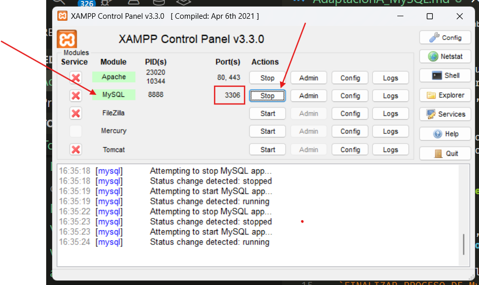
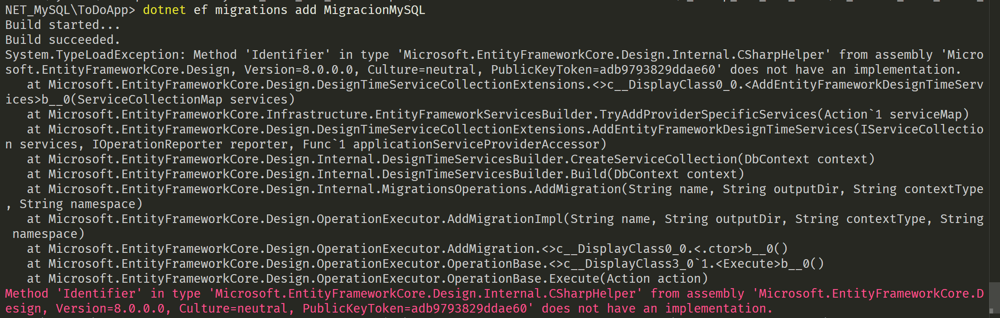

# Por qué MySQL?
Mientras que SQLite es un archivo local (ideal para apps pequeñas o móviles), MySQL es un Servidor de Base de Datos. Es lo que usarías en un entorno real donde miles de usuarios acceden a la vez. Es robusto, extremadamente rápido y, junto con PostgreSQL, el estándar de la industria.

**Recomendación:**
Dado que ya hicimos todo el trabajo duro de "cableado" en este proyecto de SQLite, vamos a usar este mismo como base. Solo tendremos que cambiar "el motor" y la "manguera", pero el resto de la carrocería (Controladores, Vistas, Modelos) ya está lista.

## Paso 1: Preparar el entorno (El Servidor)
A diferencia de SQLite, MySQL necesita un programa corriendo en tu PC.

¿Tienes instalado XAMPP, WAMP o Docker?   
**Necesitamos un servidor MySQL activo.**

Si tienes XAMPP, abre el panel de control y dale a "Start" en el módulo de MySQL.
`FINALIZAR PROCESO DE MySQLd: `  
En mi maquina esta corriendo el proceso MySQL en el puerto 3306 que es el definido para MySQL pero lo esta ocupando MysQld asi que tenemos que detener ese proceso:

1. Vamos al administrador de tareas [Ctrl] [Alt] [Supr]  
2. Seleccionamos Administrador de Tareas.
3. Ordenamos las tareas por nombre y buscamos mysqld.exe
4. Boton derecho = DETENER o FINALIZAR.

Ahora si podemos a XAMP y seleccionar star en la linea de MySQL.
Deberia abrir y mostrar conexion con PORT 3306




Paso 2: Instalación del "Conector" (NuGet)
EF Core no sabe hablar con MySQL por defecto. Necesitamos instalar una librería que haga de traductor. La más usada y recomendada para .NET 8 es Pomelo.

Ejecuta este comando en tu terminal (dentro de la carpeta ToDoApp):

---
```Bash
dotnet add package Pomelo.EntityFrameworkCore.MySql

```
---

Paso 3: Configurar la "Cadena de Conexión"
En SQLite solo decíamos el nombre del archivo. En MySQL, como es un servidor, tenemos que decir: ¿Dónde está?,

 ¿Cómo me llamo (usuario)?
 root  
  y ¿Cuál es mi clave?.
**nada** - Dejarlo vacio.


Abre tu archivo `appsettings.json` (está en la raíz del proyecto) y vamos a añadir la configuración allí para que sea más profesional. Déjalo así:

---
```json
{
  "Logging": {
    "LogLevel": {
      "Default": "Information",
      "Microsoft.AspNetCore": "Warning"
    }
  },
  "AllowedHosts": "*",
  "ConnectionStrings": {
    "DefaultConnection": "Server=localhost;Port=3306;Database=todoapp_db;User=root;Password=;"
  }
} 
```
---

**Server=localhost:** Significa que la base de datos está en tu propia PC.

**Database=todoapp_db:** Es el nombre que le daremos a la base de datos en MySQL.

**User=root;Password=;:** Son los datos por defecto de XAMPP (usuario root y sin contraseña).

Paso 4: Adaptar el Program.cs
Ahora le diremos a la aplicación: "Oye, ya no uses SQLite, ahora conéctate a MySQL usando la configuración que escribí en el archivo anterior".

Busca la línea de builder.Services.AddDbContext y cámbiala por esta:

---
```C#
// 1. Leemos la cadena de conexión del archivo appsettings.json
var connectionString = builder.Configuration.GetConnectionString("DefaultConnection");

// 2. Configuramos el contexto para usar MySQL (Pomelo)
builder.Services.AddDbContext<ApplicationDbContext>(options =>
    options.UseMySql(connectionString, ServerVersion.AutoDetect(connectionString)));
```
---

🔍 Analicemos qué acabas de hacer en ese código:
builder.Configuration.GetConnectionString(...): Esta línea es como un buscador. Va al archivo appsettings.json, busca la sección "ConnectionStrings" y extrae el valor de "DefaultConnection". La ventaja de esto es que, si mañana cambias la contraseña de tu base de datos, solo la cambias en el JSON y no tienes que tocar ni volver a compilar tu código C#.

options.UseMySql(...): Aquí es donde ocurre el cambio de motor. Le estás diciendo a Entity Framework: "Olvida el archivo .db de SQLite, ahora quiero que hables con un servidor MySQL externo".

ServerVersion.AutoDetect(...): Esta es una de las mejores funciones de Pomelo. Como MySQL tiene muchas versiones (y también existe MariaDB), esta instrucción hace una pequeña llamada al servidor de XAMPP para saber exactamente qué "dialecto" de SQL debe usar para que no haya errores de compatibilidad.

🧹 ¿Hay que limpiar la carpeta Migrations, si ya existe?
Sí, es obligatorio en este caso. Como estamos cambiando de SQLite a MySQL, los "planos" antiguos no sirven.

`Borra la carpeta Migrations por completo` (clic derecho -> Eliminar).

`Borra también el archivo tareas.db (el de SQLite)`, ya no lo necesitaremos y así evitamos confusiones.

🤔 ¿Qué significa realmente "Migración"?
En el mundo de la programación, una Migración es como un historial de cambios o un "Libro de Bitácora" para tu base de datos.

Imagina que tu base de datos es un edificio:

El Modelo (Tarea.cs): Es el diseño arquitectónico en tu mente.

La Migración: Es el plano técnico que le entregas al constructor. Dice: "Crea una pared de 5 metros llamada 'Titulo' que acepte texto".

El comando database update:  
Es el constructor levantando la pared físicamente.

¿Por qué se llama "Migración"? Porque estás "migrando" (trasladando) la estructura que definiste en tu código C# hacia el motor de la base de datos (MySQL). Cada vez que añadas un campo nuevo a tu clase Tarea (por ejemplo, "Prioridad"), crearás una nueva migración para trasladar ese cambio.

🚀 Pasos a seguir (Ahora sí)
Una vez que la carpeta Migrations esté borrada, ejecuta estos dos comandos en orden:

1. Crear el nuevo plano (idioma MySQL)

---
```bash
dotnet ef migrations add MigracionMySQL
```
---
El resultado fue:  



La IA indicó :
Ese error (System.TypeLoadException) es un clásico "conflicto de versiones". Básicamente, lo que está pasando es que tienes una herramienta de diseño (Microsoft.EntityFrameworkCore.Design) que no habla exactamente la misma versión que los otros paquetes que instalamos.

Es como si intentaras ponerle piezas de un motor modelo 2024 a un chasis modelo 2022; por fuera parecen iguales, pero los conectores internos no encajan.

🛠️ ¿Cómo lo solucionamos? (Sincronización de paquetes)
Vamos a forzar a que todos los paquetes de Entity Framework estén en la misma versión para que se entiendan entre sí. Sigue estos pasos en tu terminal:

Actualiza la herramienta global (EF Tool):
A veces la herramienta que instalamos globalmente en la PC está vieja. Ejecuta:

---
```bash
dotnet tool update --global dotnet-ef
```
----
Que dio como salida:  
`La herramienta "dotnet-ef" se reinstaló con la versión estable más reciente (versión "10.0.7").`

Sincroniza los paquetes del proyecto:
Vamos a asegurarnos de que el paquete de diseño y el de MySQL sean compatibles. Ejecuta estos tres comandos uno por uno:

---
```Bash
dotnet add package Microsoft.EntityFrameworkCore.Design
dotnet add package Microsoft.EntityFrameworkCore.Tools
dotnet add package Pomelo.EntityFrameworkCore.MySql
```
---
Al ejecutar el primer comando ( `dotnet add package Microsoft.EntityFrameworkCore.Design` ) ya me dio un error y dice que hay incompatibilidad: "Ejecutando la primera instruccion del paso 2. Sincroniza los paquetes del proyecto, entre otras informaciones indico: "error: NU1202: El paquete Microsoft.EntityFrameworkCore.Design 10.0.7 no es compatible con net8.0 (.NETCoreApp,Version=v8.0). El paquete Microsoft.EntityFrameworkCore.Design 10.0.7 admite: net10.0 (.NETCoreApp,Version=v10.0)"."

Asi que PARE! . No seguí ejecutando los siguientes y la sugerencia de la IA fue:

El error NU1202 es una "incompatibilidad de tiempo". NuGet intentó descargar la versión más reciente disponible del paquete, que resulta ser la 10.0.7, pero esa versión está diseñada para una versión de .NET (la 10) que aún no es la que tú tienes instalada. Tú estás usando .NET 8, por lo tanto, necesitamos que todos tus paquetes sean de la versión 8.0.x.

Vamos a solucionar esto forzando la versión correcta.

1. Corregir el conflicto (Instalar la versión 8.0)
Vamos a ejecutar los comandos especificando que queremos la versión 8.0.x. Abre tu terminal y ejecuta estos comandos (uno por uno):

---
```Bash
dotnet add package Microsoft.EntityFrameworkCore.Design --version 8.0.13
dotnet add package Microsoft.EntityFrameworkCore.Tools --version 8.0.13
dotnet add package Pomelo.EntityFrameworkCore.MySql --version 8.0.3
```
---

(He seleccionado la versión 8.0.13 porque es la más estable y compatible con .NET 8).
Los ejecute y no mostró errores.

2. Verificar el archivo **ToDoApp.csproj** (La "Verdad Absoluta")
Para asegurarnos de que no ha quedado ningún rastro de la versión 10, haz esto:

Abre el archivo ToDoApp.csproj en tu VS Code.

Busca la sección <ItemGroup>. Debería verse algo así:

---
```xml
<ItemGroup>
  <PackageReference Include="Microsoft.EntityFrameworkCore.Design" Version="8.0.13">
    <PrivateAssets>all</PrivateAssets>
    <IncludeAssets>runtime; build; native; contentfiles; analyzers; buildtransitive</IncludeAssets>
  </PackageReference>
  <PackageReference Include="Microsoft.EntityFrameworkCore.Tools" Version="8.0.13" />
  <PackageReference Include="Pomelo.EntityFrameworkCore.MySql" Version="8.0.3" />
</ItemGroup>  
```
---

Pero al revisar mi ToDoApp.csproj tiene muchas informacion...estaba asi:

---
```xml
<Project Sdk="Microsoft.NET.Sdk.Web">

  <PropertyGroup>
    <TargetFramework>net8.0</TargetFramework>
    <Nullable>enable</Nullable>
    <ImplicitUsings>enable</ImplicitUsings>
  </PropertyGroup>

  <ItemGroup>
    <PackageReference Include="Microsoft.EntityFrameworkCore.Sqlite" Version="8.0.0" />
    <PackageReference Include="Microsoft.EntityFrameworkCore.Design" Version="8.0.13">
      <IncludeAssets>runtime; build; native; contentfiles; analyzers; buildtransitive</IncludeAssets>
      <PrivateAssets>all</PrivateAssets>
    </PackageReference>
    <PackageReference Include="Microsoft.EntityFrameworkCore.Tools" Version="8.0.13">
      <IncludeAssets>runtime; build; native; contentfiles; analyzers; buildtransitive</IncludeAssets>
      <PrivateAssets>all</PrivateAssets>
    </PackageReference>
    <PackageReference Include="Pomelo.EntityFrameworkCore.MySql" Version="8.0.3" />
  </ItemGroup>

</Project>

```
---
Tenemos que simplificarlo y dejarlo de la siguinete forma, el ToDOApp.csproj

---
```xml
<Project Sdk="Microsoft.NET.Sdk.Web">

  <PropertyGroup>
    <TargetFramework>net8.0</TargetFramework>
    <Nullable>enable</Nullable>
    <ImplicitUsings>enable</ImplicitUsings>
  </PropertyGroup>

  <ItemGroup>
    <PackageReference Include="Microsoft.EntityFrameworkCore.Design" Version="8.0.13">
      <PrivateAssets>all</PrivateAssets>
      <IncludeAssets>runtime; build; native; contentfiles; analyzers; buildtransitive</IncludeAssets>
    </PackageReference>
    
    <PackageReference Include="Microsoft.EntityFrameworkCore.Tools" Version="8.0.13">
      <PrivateAssets>all</PrivateAssets>
      <IncludeAssets>runtime; build; native; contentfiles; analyzers; buildtransitive</IncludeAssets>
    </PackageReference>

    <PackageReference Include="Pomelo.EntityFrameworkCore.MySql" Version="8.0.3" />
  </ItemGroup>

</Project>
```
---
🧐 ¿Qué hemos quitado y por qué?
Microsoft.EntityFrameworkCore.Sqlite: BORRADO. Ya no vamos a usar archivos .db. Si dejamos este paquete, .NET podría intentar buscar drivers de SQLite innecesariamente.

Las líneas de IncludeAssets y PrivateAssets:  
LAS DEJAMOS. Aunque se vean largas, son automáticas de .NET. Sirven para decirle al sistema: "Usa estas herramientas (Design y Tools) solo mientras estoy programando en mi PC, pero no las empaques cuando subas la web a internet". Es una buena práctica.

🚀 Siguientes pasos (El orden es importante)
Una vez que guardes el archivo .csproj con el contenido que te puse arriba, sigue este orden para limpiar la "memoria" de los errores anteriores:

Entonces, el orden de seguridad total sería:

`dotnet clean` (borra basura de intentos fallidos).

`dotnet restore` (asegura que las librerías v8.0.13 están ahí).

`dotnet build` (la prueba de fuego para ver que no hay errores).

`dotnet ef migrations add MigracionMySQL` (crea los planos).

`dotnet ef database update` (construye en XAMPP).

Limpiar la carpeta obj y bin virtualmente:

---
```Bash
dotnet clean
```
---

Restaurar los paquetes (descarga solo lo que pusimos en el xml):

---
```Bash
dotnet restore  
```
---

---
```bash
dotnet build

```
---
Dio `compilacion Correcta.`

Probar el plano (La migración):
¿Qué hace? Escanea tu ApplicationDbContext y tu clase Tarea.cs.   
Como no hay carpeta de migraciones, crea una nueva desde cero, pero esta vez configurada para MySQL.   
Verás que los archivos dentro de la carpeta ahora contienen instrucciones que MySQL entiende.
Ejecuta:
---
```Bash
dotnet ef migrations add MigracionMySQL
```
---

Dio:   
Build started...
Build succeeded.


Crea la tabla  
¿Qué hace? Se conecta a tu XAMPP (usando la dirección que pusimos en appsettings.json), crea la base de datos llamada **TodoApp_MySQL** si no existe, y **crea la tabla Tareas**.
---
```bash
dotnet ef database update
```
---

Dio:
<pre>
Build started...
Build succeeded.
info: Microsoft.EntityFrameworkCore.Database.Command[20101]
      Executed DbCommand (2ms) [Parameters=[], CommandType='Text', CommandTimeout='30']
      CREATE DATABASE `todoapp_db`;
info: Microsoft.EntityFrameworkCore.Database.Command[20101]
      Executed DbCommand (12ms) [Parameters=[], CommandType='Text', CommandTimeout='30']
      CREATE TABLE `__EFMigrationsHistory` (
          `MigrationId` varchar(150) CHARACTER SET utf8mb4 NOT NULL,
          `ProductVersion` varchar(32) CHARACTER SET utf8mb4 NOT NULL,
          CONSTRAINT `PK___EFMigrationsHistory` PRIMARY KEY (`MigrationId`)
      ) CHARACTER SET=utf8mb4;
info: Microsoft.EntityFrameworkCore.Database.Command[20101]
      Executed DbCommand (4ms) [Parameters=[], CommandType='Text', CommandTimeout='30']
      SELECT 1 FROM INFORMATION_SCHEMA.TABLES WHERE TABLE_SCHEMA='todoapp_db' AND TABLE_NAME='__EFMigrationsHistory';
info: Microsoft.EntityFrameworkCore.Database.Command[20101]
      Executed DbCommand (3ms) [Parameters=[], CommandType='Text', CommandTimeout='30']
      SELECT `MigrationId`, `ProductVersion`
      FROM `__EFMigrationsHistory`
      ORDER BY `MigrationId`;
info: Microsoft.EntityFrameworkCore.Migrations[20402]
      Applying migration '20260423162908_MigracionMySQL'.
Applying migration '20260423162908_MigracionMySQL'.
info: Microsoft.EntityFrameworkCore.Database.Command[20101]
      Executed DbCommand (1ms) [Parameters=[], CommandType='Text', CommandTimeout='30']
      ALTER DATABASE CHARACTER SET utf8mb4;
info: Microsoft.EntityFrameworkCore.Database.Command[20101]
      Executed DbCommand (11ms) [Parameters=[], CommandType='Text', CommandTimeout='30']
      CREATE TABLE `Tareas` (
          `Id` int NOT NULL AUTO_INCREMENT,
          `Titulo` longtext CHARACTER SET utf8mb4 NOT NULL,
          `AsignadoA` longtext CHARACTER SET utf8mb4 NULL,
          `FechaVencimiento` datetime(6) NOT NULL,
          `Lugar` longtext CHARACTER SET utf8mb4 NULL,
          `Direccion` longtext CHARACTER SET utf8mb4 NULL,
          `Notas` longtext CHARACTER SET utf8mb4 NULL,
          `EstaCompletada` tinyint(1) NOT NULL,
          `FechaCulminacion` datetime(6) NULL,
          `RutaAdjunto` longtext CHARACTER SET utf8mb4 NULL,
          `RequiereRecordatorio` tinyint(1) NOT NULL,
          CONSTRAINT `PK_Tareas` PRIMARY KEY (`Id`)
      ) CHARACTER SET=utf8mb4;
info: Microsoft.EntityFrameworkCore.Database.Command[20101]
      Executed DbCommand (2ms) [Parameters=[], CommandType='Text', CommandTimeout='30']
      INSERT INTO `__EFMigrationsHistory` (`MigrationId`, `ProductVersion`)
      VALUES ('20260423162908_MigracionMySQL', '8.0.13');
Done.
</pre>


🔍 ¿Por qué ocurrió esto? (Explicación técnica)
El error dice que el método Identifier no tiene una implementación. Esto ocurre porque el paquete Design que tienes instalado espera encontrar una función en el "corazón" de .NET que en tu versión actual ha cambiado de nombre o de lugar. Al actualizar todos a la última versión estable (probablemente la 8.0.x), los conectores volverán a encajar.

🚀 Inténtalo de nuevo
Una vez hayas ejecutado los comandos de arriba y el dotnet build te diga "Succeeded", intenta nuevamente crear el "plano":

Bash
dotnet ef migrations add MigracionMySQL
Si te vuelve a salir el error en rojo, por favor dime qué versión de .NET estás usando (puedes verlo con dotnet --version) para darte el número de versión exacto que debemos escribir en los paquetes.


2. Construir la base de datos física

---
```Bash
dotnet ef database update
```
---


🧐 ¿Cómo sabemos si el "constructor" hizo bien su trabajo?
Abre tu navegador y entra en: http://localhost/phpmyadmin/

Verás en la lista de la izquierda tu nueva base de datos. Si entras en la tabla Tareas y vas a la pestaña "Estructura", verás que Id, Titulo, AsignadoA, etc., ya están allí esperándote.


### Recordatorios simples para terminar
📝 :
Persistencia: La diferencia entre _context.Add(objeto) y _context.SaveChanges() es la clave de todo.

Gestión de archivos: Recuerda siempre borrar físicamente lo que ya no existe en la base de datos para mantener el servidor limpio.

Versiones: Como aprendimos hoy, mantener los paquetes NuGet en la misma versión principal (en este caso 8.0.x) te ahorrará muchísimos dolores de cabeza.