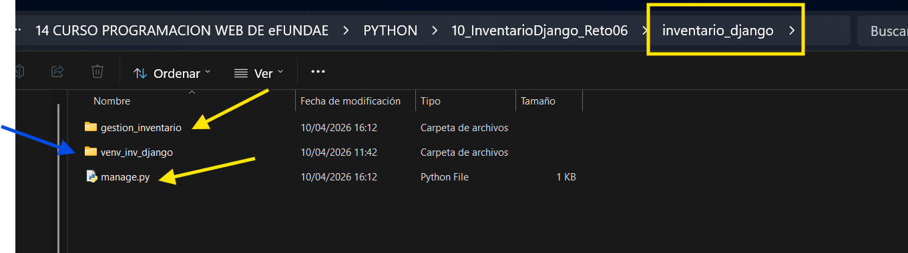
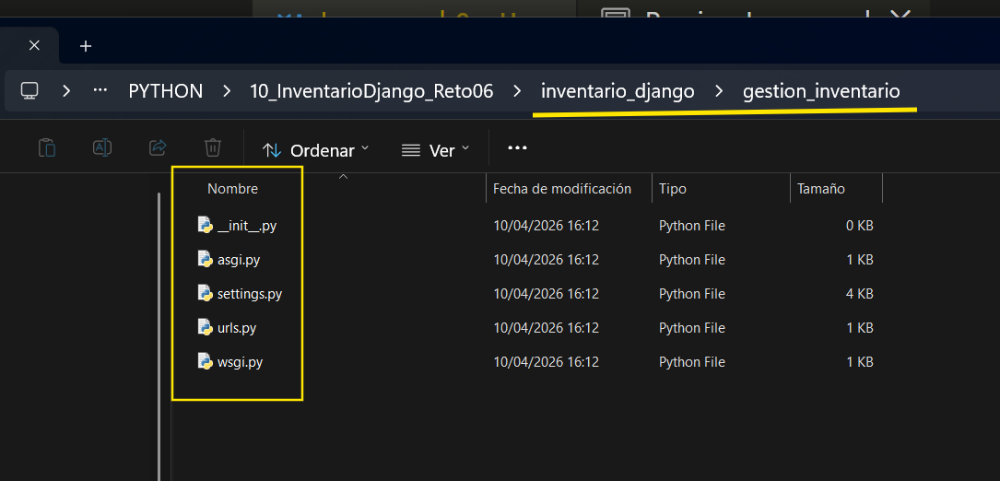
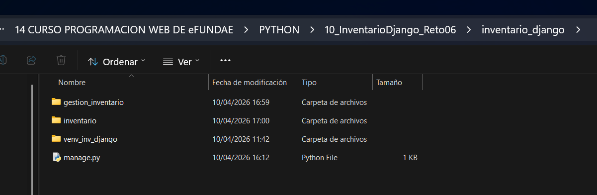
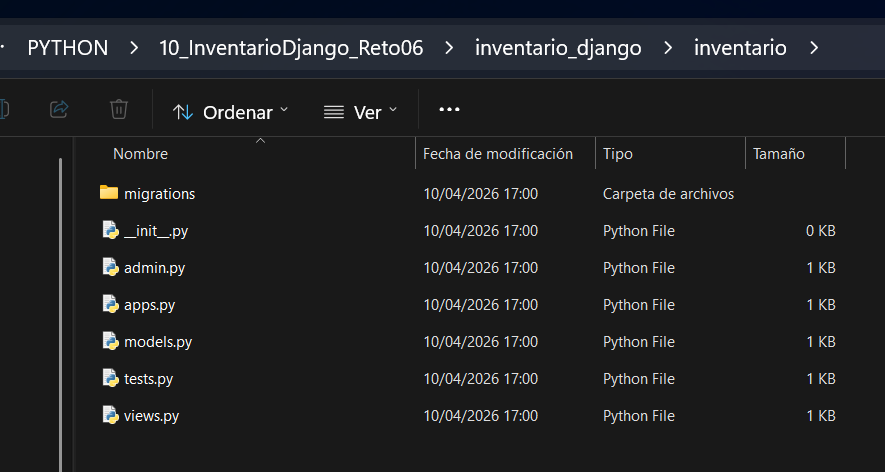
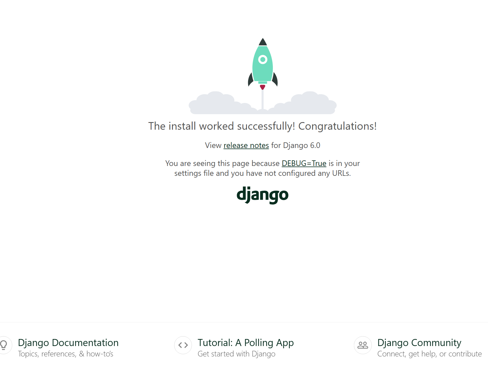
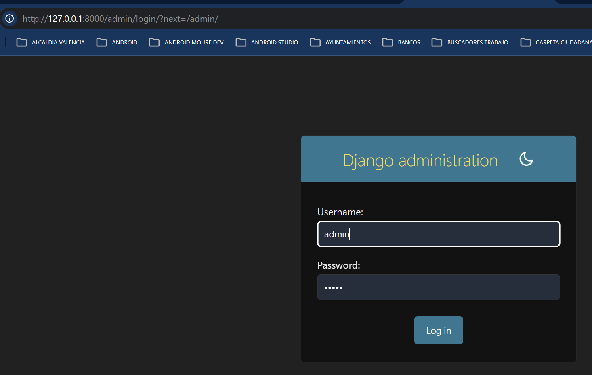
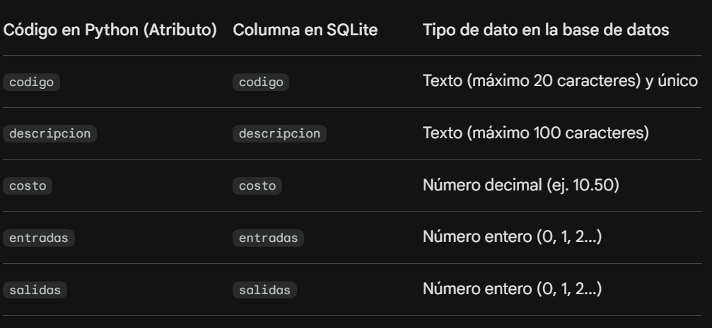

# PASOS PARA ESTE PROYECTO.
## 1 Crear el entorno para el proyecto
A. Crear la carpeta general para contener el proyecto: 10_InventarioDjango_Reto06  y dentro de ella cree lo que sera el verdadero contenedor del proyecto, una carpeta llamada "inventario_django"

B. Usando VS code, hacemos clic sobre la carpeta "inventario_django" y  boton derecho seleccionamos "Open in intregated Terminal"

C. Crear el ambiente virtual:
En el terminal :

>**python -m venv venv_inv_django**     # venv = viertual enviroment y resto inventario Django.

D. Activamos el entorno virtual: ( En la terminal) 

>**.\venv_inv_django\Scripts\activate**

Aparecera el nombre del entorno virtual (venv_inv_django) al principio de la linea

E. Si queremos ver que tiene el entorno virtual, en la terminal 

>**pip list**

Como el entorno esta vacio mostrara solamente la version de pip ( en este mostro version 25.3)

F. Instalar Django dentro del entorno ( Con el entorno activado )

>**pip install django**

Al instalar , posibemente te indique que actualices pip , lo cual se hace con :

>**python.exe -m pip install --upgrade pip**  (dentro del entorno virtual y activado)

Si volvemos a hacer pip list veremos que ahora los paquetes , dentro del entorno , son:

<pre>
Package  Version
-------- -------
asgiref  3.11.1
Django   6.0.4
pip      25.3
sqlparse 0.5.5
tzdata   2026.1
</pre>

G. Asegurarnos de que se use la version de Django que esta dentro del entorno.

Hacemos [Ctrl]+ [Shift]+[p] que abrira una barra de busqueda de configuracion en parte superior izq.

Escribimos en la busqueda **Python:Select Interpreter**

Si no aparece el python.exe relacionado con el nombre del ambiente que creamos , usualmente veremos en la segunda opcion: **Enter interpreter path..** ( Con un icono de carpeta) asi que seleccionamos esta opcion y tenemos que navegar hasta la carpeta del entorno seleccionando en la siguiente ventana: **Browse your file system to find a Python interpreter** y dentro de la carpeta del entorno seleccionamos la carpete **Scripts** y dentro de ella clic en el archivo python.exe y boton Select interpreter ( Del explorador de archivos).

## POSIBLEMENTE SEA NECESARIO VOLVER A ACTIVAR EL AMBIENTE SI NO APARECE AL INICIO DE LA LINEA DEL TERMINAL.  Volvemos aplicar paso D.

## 🚀 Paso 2: Crear el Proyecto y la Aplicación
A diferencia de Flask, donde creas un archivo .py y listo, Django tiene una jerarquía de archivos estricta.

**A. Crear el Proyecto:**  
En consola usamos el comando: 

>**django-admin startproject gestion_inventario .** (el punto final es clave para que no cree carpetas extra).

Veremos que el comando anterior crea varias carpetas y archivos:
En la terminal , ubicados en la carpeta,  vimos algo como esto: (La ruta hasta el proyecto inventario_django y luego aplicamos el comando indicado django-admin startproject gestion_inventario . ) :  
(venv_inv_django) PS E:\Python\WorkSpace curso Python_HTML_CSS_JavaScript\14 CURSO PROGRAMACION WEB DE eFUNDAE\PYTHON\10_InventarioDjango_Reto06\inventario_django> django-admin startproject gestion_inventario .

### Vista a la ubicacion de la carpeta gestion_inventario

En imagen anterior vemos que dentro de la carpeta inventario_django ( recuadro amarillo) tenemos la nueva carpeta "gestion_inventario" y el archivo "manage.py" ( señaladas con flecha amarilla).
Y se ve la carpeta del ambiente virtual. ( venv_inv_django )

### Vista del contendido de la carpeta gestion_inventario. ESTOS SON LOS ARCHIVOS GLOBALES DEL PRYECTO PUES LAS APPS TIENEN LOS SUYOS.

**B. Crear la App:**

 >**python manage.py startapp inventario.**

### Vista exterior y ubicacion de la carpeta de la app inventario....al mismo nivel que el manage.py
 

### Vista dentro de la carpeta de la app inventario. Archivos que le pertenecen a la app.

###¿Qué acaba de pasar?
Django te ha creado un montón de archivos:

**settings.py:** La configuración global (donde ya está configurado SQLite por defecto).

**urls.py:** El "mapa" de navegación.

**models.py:** Donde definiremos nuestra tabla (igual que en Flask).

**admin.py:** ¡La joya de la corona! Aquí activaremos el panel de control automático.

### Basicamente la estrutura quedara asi:

<pre style="font-size: 10px;">
inventario_django/             <-- Carpeta raíz (la que tú creaste)
│
├── venv_inv_django/           <-- 📦 TU ENTORNO VIRTUAL (Aquí están Django, pip, etc.)
│   ├── Include/
│   ├── Lib/
│   └── Scripts/               <--  Aqui esta python.exe y las funciones para activar/desactivar el entorno
│
├── manage.py                  <-- La "navaja suiza". Se usa para TODO (migrar, crear usuarios, correr el servidor).
│
├── db.sqlite3                 <-- Tu base de datos (aparece después de hacer 'migrate').
│
├── gestion_inventario/        <-- Carpeta del PROYECTO ( <strong style="color: red;">Configuración global</strong> )
│   ├── __init__.py
│   ├── settings.py            <-- El "cerebro": aquí conectas la base de datos y registras tu App.
│   ├── urls.py                <-- El "portero": decide qué URL va a qué lugar.
│   ├── asgi.py                <-- (Avanzado) Para conexiones asíncronas.
│   └── wsgi.py                <-- Para desplegar tu web en un servidor real.
│
└── inventario/                <-- <strong style="color: red;">Carpeta de tu APP </strong> (Tu lógica de inventario)
    ├── migrations/            <-- Historial de cambios en tu base de datos.
    ├── __init__.py            <-- No se debe eliminar, auqneu este vacio.
    ├── admin.py               <-- Aquí configuras el panel de administración automático.
    ├── apps.py                <-- Configuración interna de esta aplicación.
    ├── models.py              <-- ¡Aquí va tu modelo de Producto (el que ya definimos)!
    ├── tests.py               <-- Para escribir pruebas de que todo funciona.
    └── views.py               <-- ¡Aquí va la lógica de tus páginas (reporte, index, etc.)!
</pre>

Vemos que dentro de la carpeta principal; inventario_django/ , tenemos las carpetas del inventario virtual ( venv_inv_django ) , manage.py, base de datos sqlite ( si se usa), gestion_inventario e inventario.

## 📊 Paso 3: El Modelo (inventario/models.py)
Es casi idéntico a Flask, pero con la sintaxis de Django.

Ve a la carpeta inventario y abre el archivo models.py para verlo, es decir, se crea dentro de la raiz de la carpeta inventario ( Que es la APP ).

Este archivo es el corazón de tu base de datos en Django. Lo que estás haciendo aquí es definir una tabla llamada Producto mediante Programación Orientada a Objetos (ORM).

## 🛠️ Paso 4: Activar el Panel de Administrador
Aquí es donde Django te va a volar la cabeza. En Flask tuvimos que programar un formulario para crear productos. En Django solo haces esto en inventario/admin.py:

Es decir, dentro de admin.py en la APP inventario colocamos: 

>from django.contrib import admin
>from .models import Producto

>admin.site.register(Producto)

## ⚡ Paso 5: Registrar la APP
Django necesita "preparar" la base de datos antes de arrancar.

## Registrar la App: 
Ve a **gestion_inventario/settings.py** y **añade** 'inventario', a la lista de INSTALLED_APPS.

Se vera asi la parte del codigo en settings.py ( OJO: Es del Proyecto )

<pre>
INSTALLED_APPS = [
    'django.contrib.admin',
    'django.contrib.auth',
    'django.contrib.contenttypes',
    'django.contrib.sessions',
    'django.contrib.messages',
    'django.contrib.staticfiles',
    'inventario',
]
</pre>

## ⚡ Paso 6: Migraciones y Superusuario
### Crear tablas de la base de datos:

En la terminal: 

>**python manage.py makemigrations**
>**python manage.py migrate**

Al aplicar :**python manage.py makemigrations**

<pre>
El terminal mostro:
Migrations for 'inventario':
  inventario\migrations\0001_initial.py
    + Create model Producto
</pre>

Al aplicar : **python manage.py migrate**

<pre>
Se genero:
python manage.py migrate
Operations to perform:
  Apply all migrations: admin, auth, contenttypes, inventario, sessions
Running migrations:
  Applying contenttypes.0001_initial... OK
  Applying auth.0001_initial... OK
  Applying admin.0001_initial... OK
  Applying admin.0002_logentry_remove_auto_add... OK
  Applying admin.0003_logentry_add_action_flag_choices... OK
  Applying contenttypes.0002_remove_content_type_name... OK
  Applying auth.0002_alter_permission_name_max_length... OK
  Applying auth.0003_alter_user_email_max_length... OK
  Applying auth.0004_alter_user_username_opts... OK
  Applying auth.0005_alter_user_last_login_null... OK
  Applying auth.0006_require_contenttypes_0002... OK
  Applying auth.0007_alter_validators_add_error_messages... OK
  Applying auth.0008_alter_user_username_max_length... OK
  Applying auth.0009_alter_user_last_name_max_length... OK
  Applying auth.0010_alter_group_name_max_length... OK
  Applying auth.0011_update_proxy_permissions... OK
  Applying auth.0012_alter_user_first_name_max_length... OK
  Applying inventario.0001_initial... OK
  Applying sessions.0001_initial... OK
  </pre>

## 🖥️ Paso 7: Crear tu cuenta de SuperUsuario en el administrados

En la terminal escribimos la instruccion:  

>**python manage.py createsuperuser**
(Sigue los pasos para poner un usuario y contraseña).

<pre>
Username (leave blank to use 'barbu'): admin
Email address:                             (Se puede dajar en blanco) 
Password:                                  ( Al escribirlo parece que no lo toma , PERO si lo toma)
Password (again):                          ( Igual que anterior. Parece que no responde pero si lo toma)
( **USERNAME : admin y Password : admin** )

The password is too similar to the username.
This password is too short. It must contain at least 8 characters.
This password is too common.
Bypass password validation and create user anyway? [y/N]: y  ( Le dije que acepte que es corta y son iguales)
Superuser created successfully.
</pre>

# Paso 8. USER NAME y PASSWORD DEL ADMINISTRADOR:
Se definen con el comando del punto anterior. Yo elegi que sean iguales y que bypass la validacion , permitiendo que sean iguales los dos.

**User    : admin** 
**Password: admin**

## 🖥️ Paso 9: ¡A correr!
Ejecuta el servidor: En el terminal

>**python manage.py runserver**

El resultado de correr fue:

Ahora ve a: http://127.0.0.1:8000/admin e ingresa tus datos.

lo tengo configurado para:

>**usuario: admin**
>**clave  : admin**

Debemos encontrar un panel completo para crear, editar, borrar y buscar productos sin haber escrito ni una línea de HTML todavía. Django ya creó la base de datos SQLite.

Dentro del panel de administracion seleccionamos a Producto para añadir varios.

# Paso 10. Añadir la cara visible es decir las vistas.

En Django, para mostrar una página necesitamos tres cosas: 

1. Template (el HTML),  
2. View (la lógica) y  
3. URL (la dirección). 

## Paso 10.1 El Templete ( archivos HTML)

**1. Crear la Carpeta de Templates**
Django busca los archivos HTML en una carpeta específica. ( templates dentro de la raiz de la App )

Dentro de tu carpeta **inventario/** , crea una carpeta llamada **templates**.

Dentro de templates/, crea otra carpeta llamada inventario/ (sí, Django recomienda repetir el nombre para evitar confusiones entre apps).

Ahí dentro, crea el archivo reporte.html.

**Ruta final: inventario/templates/inventario/reporte.html**

Esta CADENA de ruta final se repite para cada template o archivo HTML y para todas las APP que se incluyan en el proyecto, para evitar confusiones, por ejemplo del archivo index.html. Por ejemplo, teniendo 3 app , dentro de la raiz de cada una crearemos un directorio templates y dentro de esos templates creamos nuevas carpetas con el mismo nombre de la app y luego dentro de cada uno el respectivo index.html.

app1/templates/app1/index.html 
app2/templates/app2/index.html 
app3/templates/app3/index.html ..... 

**2. Colocamos o codificamos el archivo reporte.html en la ruta inventario/templates/inventario/**

Simplemente creamos el archivo reporte.html y lo guardaremos y debe quedar ubicado en la ruta:  
inventario/templates/inventario/reporte.html

## 10.2 La Lógica en inventario/views.py ( La vista equivale al Controlador)
Aquí es donde Django brilla. Vamos a consultar los datos y calcular el total del almacén.

Ve el archivo inventario/views.py  y mas abajo, en la seccion de VEAMOS LA EXPLICACION DEL CODIGO ...., los detalles de como se hizo.

## 10.3. El Mapa de Rutas (inventario/urls.py)
Django no usa decoradores como @app.route. Usa un archivo central de URLs.
Crea el archivo inventario/urls.py (este archivo no existe, hay que crearlo):

<pre>
from django.urls import path
from . import views

urlpatterns = [
    path('', views.index, name='index'),
    path('reporte/', views.reporte, name='reporte'),
]
</pre>

## 10.3A OJO, EL PROYECTO DEBE ENTERARSE DE LAS URLS
Hay que avisar al proyecto principal (gestion_inventario/urls.py) que use estas rutas:

En las rutas hay que incluir la linea: 

 **path('', include('inventario.urls')),** # Conectamos las URLs de nuestra app

El include la pintara en rojo porque necesita importarlo...entonces la importacion debe contenerlo: 
from django.urls import path, **include**  

Es decir, añadimos la palabra **include** en la importancion de from django.urls

# VEAMOS EXPLICACION DEL CODIGO DE CADA PARTE DEL PROGRAMA.

## MODELOS.PY

Aquí tienes el desglose paso a paso:

**1. Importación y Definición de la Clase**
>**from django.db import models:**  
>Importas el módulo de Django que contiene todas las herramientas para interactuar con bases de datos.

>**class Producto(models.Model):** : Aquí defines tu tabla. Al heredar de models.Model, Django entiende que esta clase debe convertirse en una tabla de SQLite.

**2. Definición de los Campos (Columnas)**
Cada variable dentro de la clase representa una columna en tu base de datos:

>**codigo = models.CharField(...):** Un campo de texto corto. max_length=20: Limita el texto a 20 caracteres.

>**unique=True:** Garantiza que no haya dos productos con el mismo código (funciona casi como una llave primaria).

>**descripcion = models.CharField(max_length=100)** : Otro campo de texto para el nombre o detalle del producto.

>**costo = models.DecimalField(...)**: Ideal para dinero.

>**max_digits=10**: El número total de dígitos permitidos.

>**decimal_places=2**: Cuántos de esos dígitos son decimales (ej. 99999999.99).

>**entradas y salidas (PositiveIntegerField)** : Campos para números enteros que no permiten valores negativos. El default=0 asegura que, si no pones nada, el conteo empiece en cero.

**3. Propiedades Calculadas (@property)**
Estas no son columnas en la base de datos, sino funciones que se comportan como si fueran atributos. Son muy útiles porque se calculan "al vuelo":

**@property**:
 >Es un decorador de Python que te permite llamar a la función como si fuera una variable (usarías producto.stock_actual en lugar de producto.stock_actual()).

**stock_actual**: Simplemente resta las salidas de las entradas para decirte cuánto hay en bodega.

**valor_inventario**: Multiplica el stock por el costo.

Nota técnica: Usas float(self.costo) porque DecimalField devuelve un objeto tipo Decimal, y para operaciones matemáticas rápidas a veces se prefiere convertirlo, aunque en Django financiero es más seguro operar directamente con Decimal.

**4. El Método Especial __str__**
def __str__(self):: Este método define cómo se verá el objeto cuando lo mires en el panel de administración de Django o en la consola.

En lugar de ver algo genérico como <pre><Producto object (1)> </pre>, verás algo legible como A101 - Martillo de acero.

### ¿Cómo entiende esto SQLite?
Cuando ejecutas las migraciones, Django traduce ese código Python a lenguaje SQL. 

Django traduce tu código a SQLite,es decir transforma 0transforma tus instrucciones de Python en una tabla de Excel gigante (por decirlo de forma sencilla).Aquí tienes cómo se traduce el código de la base de datos:

El "Traductor" de Django (ORM)Tú escribiste una Clase, pero SQLite recibe una Tabla:

Un pequeño consejo:
Hay que tener en cuenta que valor_inventario y stock_actual se calculan cada vez que los pides. Si tienes 10,000 productos, esto es eficiente, pero si haces reportes complejos, en el futuro podrías considerar guardar esos totales en campos reales de la base de datos.

¿Y qué pasa con lo demás?
Es normal que te preguntes: "¿Dónde quedaron stock_actual y valor_inventario?"

En la base de datos (SQLite): Estas dos cosas no existen. La base de datos es "tonta", solo guarda los datos fijos (el costo, cuántos entraron, cuántos salieron).

En Python: Cuando tú le pides a Django un producto, él saca los datos de la tabla y, gracias a las funciones que escribiste con @property, hace la cuenta matemática en ese mismo instante.

Ejemplo visual de un registro:
Si en tu base de datos guardas esto:

codigo: "LAP-01"

entradas: 10

salidas: 3

En el programa de Python, cuando usamos **producto.stock_actual**, mágicamente verás un 7, aunque ese 7 no esté escrito en ningún archivo de la base de datos. **Se calcula "en vivo"**.

**¿Cómo se ve el archivo de SQLite?** 
SQLite no es una carpeta con carpetas, es un solo archivo (normalmente llamado db.sqlite3) que vive en la carpeta del  proyecto. No se puede leer abriéndolo con el bloc de notas (verás puros símbolos raros).

Para verlo como una tabla real, la forma más fácil es entrar al Admin de Django en tu navegador una vez que corras el servidor.

# ACTIVACION DEL PANEL DE ADMINISTRADOR 
Se hace registrando el modelo en el panel de administrador. 

**Ver el codigo admin.py dentro de la App inventario.**

Con este código se hace que el modelo Producto sea visible y editable. Sin estas líneas, la base de datos existiría, pero no tendrías una interfaz visual para manejarla.

La explicacion de cada instruccion:

**1. La Importación del Administrador**

>**from django.contrib import admin**

**Qué hace:** Trae las herramientas necesarias de Django para gestionar el panel de control. Django viene con un **"sitio de administración"** ya construido de fábrica, y esta línea permite interactuar con él.

**2. Importar tu Modelo**

>**from .models import Producto**

**Qué hace:** Le dice al archivo admin.py: "Oye, ve al archivo models.py (eso significa el punto .) y tráeme la clase Producto que definimos antes".

Sin esto, el administrador no sabría qué tabla quieres mostrar.

**3. El Registro**

>**admin.site.register(Producto)**

**Qué hace:** Esta es la instrucción mágica. Le ordena a Django: "Crea una sección en el panel de administración para que yo pueda crear, editar, ver y borrar registros de la tabla Producto".

**¿Qué verás en el navegador?**
Cuando entres a la dirección del administrador (normalmente http://127.0.0.1:8000/admin), verás algo parecido a esto:
<pre>

    Un botón de "Add" (+): Al hacer clic, Django generará automáticamente un formulario con los campos que definiste (codigo, descripcion, costo, etc.).

    Una lista de productos: Aquí es donde entra en juego el método __str__ que explicamos antes. Gracias a ese método, verás el código y la descripción en la lista en lugar de un texto aburrido que diga "Object 1".

    Validación automática: Si intentas guardar un producto con un codigo que ya existe, el Admin te dará un error porque usamos unique=True en el modelo.

</pre>

Un "Truco" Pro: Hacerlo más profesional
Si quieres que en la lista principal se vean todas las columnas (como el costo y el stock) y no solo lo que pusiste en el __str__, puedes cambiar tu código por este otro, que hará que el  panel parezca una verdadera tabla de inventario profesional.

@admin.register(Producto)
class ProductoAdmin(admin.ModelAdmin):
    # Aquí eliges qué columnas quieres ver en la lista principal
    list_display = ('codigo', 'descripcion', 'costo', 'stock_actual')

El archivo **admin.py** de la app inventario quedaria asi:

from django.contrib import admin
from .models import Producto  # Importamos el modelo

#Esta es la forma "avanzada" y elegante de registrarlo
@admin.register(Producto)
class ProductoAdmin(admin.ModelAdmin):
    # Aquí defines qué columnas se verán en la tabla del administrador
    list_display = ('codigo', 'descripcion', 'costo', 'stock_actual')
    
    # Opcional: puedes agregar un buscador por código o descripción
    search_fields = ('codigo', 'descripcion')

# DETALLES DE views.py

## 🔬 Anatomía de views.py
1. Las Importaciones (Las Herramientas)  

from django.shortcuts import render, redirect, get_object_or_404
from .models import Producto

**render:** 
Es el motor que combina tus datos de Python con el archivo HTML.

**redirect:** 
Le dice al navegador: "Vete a esta otra URL". Es vital tras un POST para evitar que el usuario reenvíe el formulario al refrescar.

**get_object_or_404:** 
Es un "guardaespaldas". Busca un producto; si lo encuentra, te lo da, y si no existe (ej. escribiste mal el código), detiene todo y muestra una página de error 404 limpia en lugar de que el servidor se rompa.

**from .models import Producto:** 
Importas la clase que definimos. Sin esto, la vista no sabría qué es un "Producto".

2. La función index (El Controlador Inteligente)
Esta función es "multitarea" porque gestiona dos formularios distintos en una misma vista.

def index(request):
    if request.method == 'POST':
 
**request:** 
Es un objeto que contiene TODO lo que viene del navegador (cookies, datos del form, IP, etc.).

**if request.method == 'POST':**
Aquí discriminamos. Si el usuario solo está "viendo" la página, saltamos al final. Si pulsó un botón de enviar, entramos aquí.

**Caso A: Alta de productos**

if 'crear_producto' in request.POST: 
    Producto.objects.create(...)
if 'crear_producto' in request.POST:  
Django mira qué botón se pulsó analizando el atributo name del button en el HTML.

**Producto.objects.create:**
Es el comando del ORM de Django. No escribes SQL (INSERT INTO...), simplemente le pasas los datos y Django se encarga de hablar con la base de datos SQLite.

**Caso B: Lógica de Inventario**

**elif 'actualizar_stock' in request.POST:**
    producto = get_object_or_404(Producto, codigo=request.POST.get('codigo_mov'))
    ...
    producto.save()
request.POST.get('tipo'): Extrae lo que el usuario seleccionó en el select ( etiqueta).

**producto.save():** Crucial. A diferencia del .create(), cuando modificas un objeto que ya existe, los cambios solo están en la "RAM". .save() los escribe físicamente en el archivo db.sqlite3.

**return redirect('reporte')**
Tras procesar cualquier formulario, mandamos al usuario a la vista de resultados. Esto limpia la memoria del navegador.

3. La función reporte (La Consulta)
Esta vista es de tipo "Solo Lectura".

def reporte(request):
    productos = Producto.objects.all()

**Producto.objects.all():** Es el equivalente a SELECT * FROM Producto. Trae una lista (QuerySet) con todos los registros.

total = sum(p.valor_inventario for p in productos)
Aquí usamos una comprensión de lista en Python. Llama a la @property que definimos en el modelo para cada producto y suma los resultados. Lo mejor es que el cálculo ocurre justo antes de enviar la página al usuario.

**return render(request, 'inventario/reporte.html', {'productos': productos, 'total': total})**
El tercer argumento es el Contexto. Es un diccionario donde le pasas "nombres" al HTML. En el HTML usarás  porque aquí le pusiste el nombre 'productos'.

**🎯 Puntos Clave que lo diferencian de Flask:**
Explícito sobre Implícito: En Flask usabas db.session.add(), aquí usas el manager del modelo (Producto.objects).

Seguridad: Al usar get_object_or_404, Django te ahorra escribir bloques try/except para errores de base de datos.

ORM Integrado: Fíjate que no hay ninguna línea de SQL. Django abstrae todo el motor de base de datos.

## 🛤️ Desglose de inventario/urls.py
### 1. Las Importaciones

from django.urls import path
from . import views

**path:** Es la función básica de Django para definir una ruta.

**from . import views:** El punto (.) significa "esta misma carpeta ( directorio )". Estás trayendo el archivo views.py para que Django sepa qué funciones llamar cuando alguien entre a una dirección.

### 2. La lista urlpatterns
Es una lista obligatoria donde registras cada camino de tu web.

urlpatterns = [
    path('', views.index, name='index'),
**'' (Comillas vacías):** 
Representa la raíz. Si tu web es http://127.0.0.1:8000/, esta es la página que carga por defecto.

**views.index:**  
Le dice a Django: "Cuando alguien entre aquí, ejecuta la función index que está en el archivo views.py".

**name='index'**:  
Este es el nombre interno. Es vital porque en tu HTML usas . Si mañana decides que la ruta ya no sea el vacío sino /inicio/, solo lo cambias aquí y todos tus enlaces en el HTML seguirán funcionando automáticamente.

    path('reporte/', views.reporte, name='reporte'),
]

**'reporte/'**:  
Define la dirección URL. El usuario tendrá que escribir .../reporte/ para ver la tabla.

**Nota Pro:** Django siempre recomienda terminar las rutas con una barra inclinada /. Si el usuario escribe /reporte (sin barra), Django lo redirigirá automáticamente a /reporte/.

**🔗 La conexión con el Proyecto Global**
Es importante recordar que este archivo no trabaja solo. Para que funcione, tuviste que ir al urls.py de la carpeta gestion_inventario (el corazón del proyecto) y añadir esto:

**path('', include('inventario.urls')),**

**¿Por qué Django lo hace así?**
A diferencia de Flask, donde las rutas suelen estar todas mezcladas con el código, Django usa esta estructura por escalabilidad:

**Centralización:** El proyecto principal tiene un "mapa maestro" de aplicaciones.

**Independencia:** Tu aplicación inventario es un módulo cerrado. Podrías copiar la carpeta inventario completa a otro proyecto, incluirla en su urls.py y funcionaría al instante.

**🎯 Puntos Clave:**
**Orden:** El orden en la lista importa. Django lee de arriba hacia abajo y se queda con la primera coincidencia que encuentre.

**Nombres Únicos:** El name='...' debe ser único para no confundir al motor de plantillas.